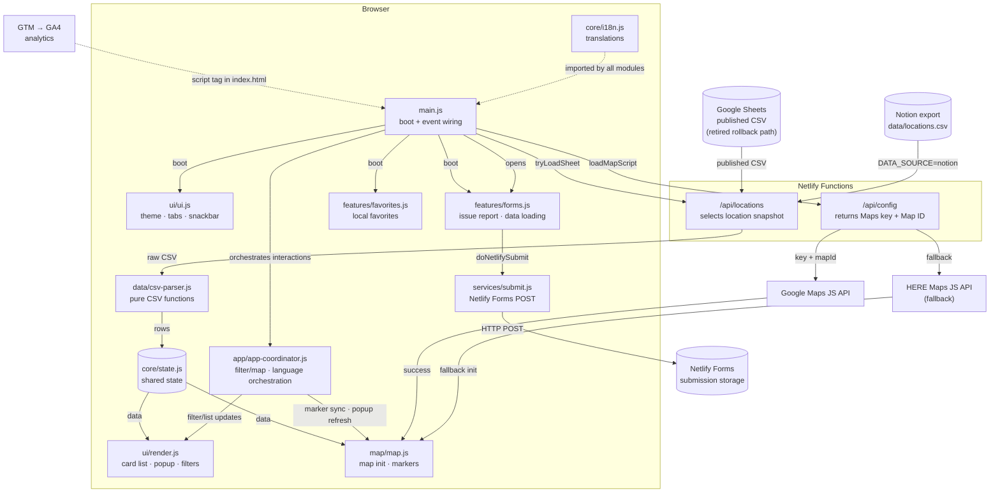
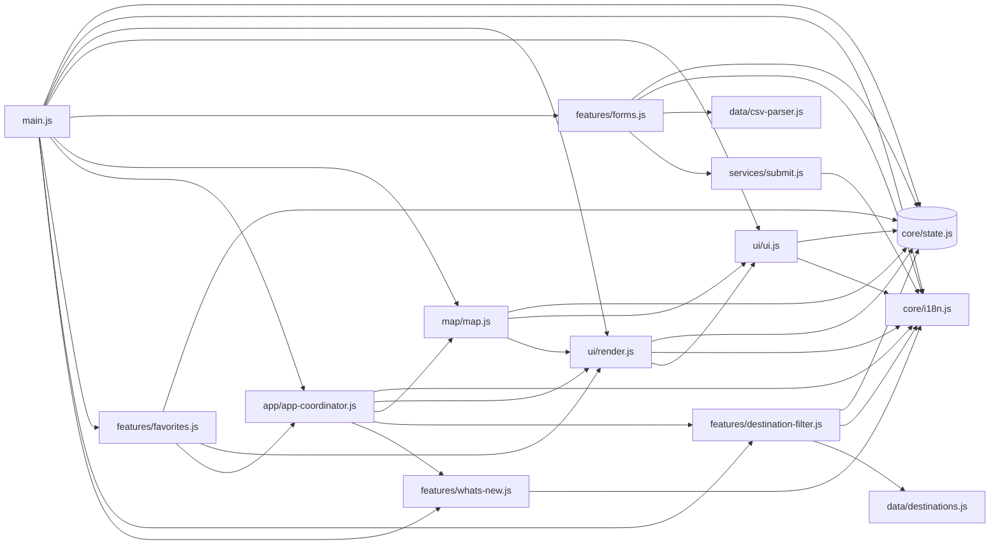

# Lingorm Map

Lingorm 曼谷踩點地圖 — An interactive map of Bangkok locations spotted in Lingorm's content. Built as a vanilla JavaScript + Vite static site, deployed on Netlify. TypeScript is used only as a development-time, no-emit `checkJs`/JSDoc checker; the application remains JavaScript.

🌐 **Live:** https://lingorm-map.netlify.app

---

## Features

- Interactive map with consistent brand-color emoji category markers
- Card list with search, category, destination, and favorites filters
- Country-grouped destination multi-select with persisted choices and automatic map fitting
- Popup with Navigate + Open in Google Maps buttons (responsive: icon-only on mobile)
- zh / en bilingual UI with one-click toggle
- Light / dark theme
- Low-friction issue reporting via Netlify Forms
- Mobile-responsive with map / list tab switching and scroll
- Google Maps primary; HERE Maps fallback if Google Maps is unavailable
- Analytics via Google Tag Manager (GTM-NVNXGP44) + GA4 (G-31MF79LHFM)

---

## Architecture

The app is a static site with two Netlify Functions acting as a thin backend proxy. All state lives in the browser.

### Boot sequence

On page load, `main.js` kicks off two parallel flows:

1. **Data flow** — `tryLoadSheet()` calls `/api/locations`, which serves the committed Notion export snapshot (`DATA_SOURCE=notion`, the only supported value; the legacy published Google Sheets CSV path is retired — see Deploy section). The response is tokenised by `data/csv-parser.js`, normalised into a flat array, and stored in `core/state.js`. Once loaded, `rebuild()` triggers `ui/render.js` (card list + filters) and `map/map.js` (place markers).

2. **Map flow** — `loadMapScript()` calls `/api/config` to retrieve the Google Maps API key and Map ID (never exposed client-side directly). It injects the Google Maps JS script; if that fails or the key is absent, it falls back to the HERE Maps JS API. Either way, `initMap()` runs and markers are placed via `buildMarkers()`.



**Module import graph** (static dependencies):



### Module responsibilities

| Module | Role |
|--------|------|
| `main.js` | Entry point — boot sequence and all event listener wiring |
| `app/app-coordinator.js` | Application orchestration for filter/map synchronization and language changes |
| `core/state.js` | Single mutable object shared across modules |
| `core/i18n.js` | zh/en translations and the `t()` helper |
| `data/csv-parser.js` | CSV tokeniser + `parseCSV` + `normalizeStatus` (pure functions) |
| `data/destinations.js` | Canonical country and destination taxonomy |
| `services/submit.js` | Shared Netlify Forms POST and feedback reset |
| `map/map.js` | Google / HERE map init, marker synchronization, popup refresh, and theme sync |
| `map/map-globals.d.ts` | Ambient types for dynamically loaded Google and HERE SDK globals |
| `features/destination-filter.js` | Destination multi-select UI, country grouping, and persisted selection |
| `features/favorites.js` | Favorite persistence and toggle behavior |
| `features/forms.js` | Issue report modal, validation, and location-data loading |
| `features/whats-new.js` | Changelog modal state and rendering |
| `ui/render.js` | Card list HTML, popup content, and map-independent filter rendering |
| `ui/ui.js` | Theme primitives, tab switching, snackbar, locate-me, and navigation |

### Key constraints

- **No secrets in client JS.** The Google Maps key is fetched at runtime from `/api/config` (a Netlify Function that reads `process.env`), never bundled into `dist/`.
- **HERE as fallback, not primary.** If `GOOGLE_MAPS_KEY` / `GOOGLE_MAP_ID` are absent or the script load fails, the app transparently switches to HERE Maps.
- **No framework.** Vanilla JS + Vite — no React/Vue/Angular. DOM updates are string-templated HTML re-renders (card list) or direct marker manipulation (map).

---

## Tech Stack

| Layer | Choice |
|-------|--------|
| Map | Google Maps JS API (`AdvancedMarkerElement`, `colorScheme`) with HERE Maps fallback |
| Data | Notion system of record → committed CSV snapshot (`DATA_SOURCE=notion`, the only supported source; the legacy Google Sheets rollback path is retired) |
| Forms | Netlify Forms (`issue-report`) |
| Analytics | Google Tag Manager (GTM-NVNXGP44) → GA4 (G-31MF79LHFM) |
| Build / check | Vite 6 + TS `checkJs` (no emit), ES modules in `src/` |
| Deploy | Netlify (GitHub auto-deploy) |
| Tests | Node.js built-in `node:test` — 256 tests |

---

## Project Structure

```
lingorm_bangkok_map/
├── index.html              # HTML markup; loads src/main.js as ES module
├── styles.css              # CSS custom properties (light/dark theme)
├── src/
│   ├── main.js             # Entry point — wires event listeners, boot sequence
│   ├── app/
│   │   └── app-coordinator.js # Application/use-case orchestration
│   ├── core/
│   │   ├── state.js        # Shared mutable state object
│   │   └── i18n.js         # Translations (zh/en) and t()
│   ├── data/
│   │   ├── destinations.js # Canonical country/destination taxonomy
│   │   └── csv-parser.js   # CSV tokenizer + parseCSV (pure functions)
│   ├── services/
│   │   └── submit.js       # Shared Netlify Forms submit transport
│   ├── map/
│   │   ├── map.js          # Google/HERE integration and marker synchronization
│   │   └── map-globals.d.ts # Ambient map SDK globals
│   ├── features/
│   │   ├── favorites.js    # Favorite persistence and toggles
│   │   ├── destination-filter.js # Destination multi-select and persistence
│   │   ├── forms.js        # Issue report modal and location-data loading
│   │   └── whats-new.js    # Changelog modal
│   └── ui/
│       ├── render.js       # Card list, popup content, filter helpers
│       └── ui.js           # Theme, tabs, snackbar, locate me, navigation
├── netlify/
│   └── functions/
│       ├── config.mjs      # /api/config — returns Maps key + map ID
│       └── locations.mjs   # /api/locations — sheet/snapshot source switch
├── data/
│   └── locations.csv       # validated 130-row formal Notion export snapshot
├── scripts/
│   ├── export-snapshot.mjs # Notion API → stable site CSV contract
│   └── validate-location-snapshot.mjs # production snapshot deploy gate
├── tests/                  # node:test test suite
├── jsconfig.json           # Strict incremental TypeScript checkJs configuration
├── vite.config.js          # Vite build config
├── build.sh                # Netlify pre-build: validates env vars + snapshot
├── netlify.toml            # build command, publish dir, functions dir, /api/* redirect
└── note/TECH_DECISIONS.md  # Architecture decision records
```

---

## Local Development

### Prerequisites

```bash
node --version   # 18+
npm install
netlify --version  # install if missing: npm i -g netlify-cli
netlify login && netlify link
```

### Environment variables

Create `.env` in the project root (not committed — copy from `.env.example`):

```
HERE_API_KEY=your_here_api_key          # required — fallback map provider
GOOGLE_MAPS_KEY=your_google_maps_key    # optional — primary map provider
GOOGLE_MAP_ID=your_google_map_id        # optional — required if using Google Maps
DATA_SOURCE=notion                      # optional — notion is the default and only supported value
```

`DATA_SOURCE=sheet` (the legacy Google Sheets rollback path) is retired as of
the 2026-07-21 three-status cutover — `normalizeStatus()` no longer maps
legacy `verified`/`needs review` to `Published`, so it would render zero
public locations.

Get a HERE API key at [developer.here.com](https://developer.here.com) → Projects → REST → Create API key (free tier: 250k map transactions/month).

### Run locally

```bash
netlify dev        # http://localhost:8888
```

This runs Vite + Netlify Functions together. Do **not** open `index.html` directly — the Netlify Functions (`/api/config`, `/api/locations`) won't be available.

### Static type checking

```bash
npm run typecheck
```

The project stays in `.js` files and Vite remains responsible for production output. TypeScript runs only in development with `noEmit`, using strict `checkJs` and JSDoc contracts. The current primary scope is `app/app-coordinator.js`, `core/state.js`, `data/csv-parser.js`, `map/map.js`, and `features/forms.js`; TypeScript also follows their imported module boundaries, where narrow annotations and strict DOM-null fixes may be required. Coverage will expand incrementally rather than through a wholesale TypeScript migration.

### Unit tests

```bash
npm test
```

Expected: all tests pass with 0 failures.

### Pre-deploy verification

```bash
npm run typecheck
npm test
npm run build      # outputs to dist/
```

---

## Deploy

Use a feature branch and PR Deploy Preview. After preview verification, merge
the PR into `main`; Netlify runs `bash build.sh && npm run build` and publishes
`dist/`.

For the complete Notion snapshot, preview, production, and rollback procedure,
see [Notion Data Source Deployment Workflow](docs/notion-deploy-workflow.md).

Required Netlify environment variables (Dashboard → Site Settings → Environment Variables):

| Variable | Required | Purpose |
|----------|----------|---------|
| `HERE_API_KEY` | ✅ | HERE Maps JS API key (fallback provider) |
| `GOOGLE_MAPS_KEY` | optional | Google Maps JS API key (primary provider) |
| `GOOGLE_MAP_ID` | optional | Map ID for dark mode + AdvancedMarkerElement |
| `DATA_SOURCE` | optional | `notion` (default and only supported value); requires a redeploy when changed |

If `GOOGLE_MAPS_KEY` / `GOOGLE_MAP_ID` are omitted, the map loads HERE Maps directly. If both Google and HERE keys are present, Google Maps is used as primary with HERE as fallback.

### Netlify Forms

Enable form detection in Netlify Dashboard → **Forms → Enable form detection**, then redeploy. The only public form is `issue-report`.

### Analytics

GTM snippet is embedded in `index.html` (`<head>` + noscript `<body>`). All tracking configuration (GA4 tag, triggers) is managed in the GTM dashboard — no code changes needed to add/modify events.

### Google Maps key protection

The Maps key is delivered via `/api/config` (Netlify Function). Protect it with:

1. **HTTP Referrer restriction** in Cloud Console → Credentials (allow `https://lingorm-map.netlify.app/*`)
2. **Daily quota cap** — Maps JS API → Quotas → Map loads/day = 900
3. **Billing alert** at $5

---

## Data Schema

Production uses the committed Notion snapshot at `data/locations.csv`:

```
"Location Name","Location Name ZH","Thai / Alt Name","Google Maps URL",
"Category","Notes","Notes ZH","Source URL","Source Tags","Verification Status",
"Lat","Lng","Icon","Country Code","Destination Key","Slug"
```

The current formal Notion data source has 19 properties: 16 content fields and
the three verification fields `Review Needed`, `Verification Note`, and
`Last Verified`. Verification fields are not exported to the public snapshot.
`Coordinates Approx` and `Branch Group` have been retired from the formal
schema; the parser still accepts `Coordinates Approx` only on the legacy Google
Sheet rollback path.

The formal data source accepts exactly three status values: `Published`,
`Paused`, and `Inactive`. Only `Published` locations appear on the public site;
`Paused`, `Inactive`, and all unknown or blank inputs remain hidden. Legacy
status names are accepted only while parsing old rollback exports and are
normalized to `Paused` or `Inactive`; they are never emitted by the current
snapshot contract.

Every `Published` row must contain a supported `Country Code` and
`Destination Key` pair. Missing or mismatched geography fails snapshot
validation and therefore blocks the build/deploy path. Paused and inactive
drafts may remain unclassified until they are ready to publish.

Generate a candidate snapshot from the allowlisted formal data source with:

```bash
npm run locations:export:notion -- --output data/locations.next.csv
node scripts/validate-location-snapshot.mjs data/locations.next.csv
```

The exporter reads `NOTION_API_KEY` (the sole Notion credential — see
Environment variables above), verifies the live 19-property schema before
querying rows, and never writes to Notion.

---

## Map Markers

Markers are 28px brand-color emoji circles. Public status is intentionally not
encoded in marker color. The emoji comes from `row.icon` and falls back to 📍
if missing.

---

## Reporting Issues

Use **問題回報 / Report Issue** for incorrect location data, map problems, or
site errors. This is the only public contribution flow.

---

## Running Tests

```bash
node --test tests/*.test.mjs
```

| File | What it covers |
|------|---------------|
| `parsecsv.test.mjs` | CSV tokenizer, parser, status normalizer, source helpers |
| `source-tags.test.mjs` | `renderSources` — Threads handle extraction, platform URL mapping |
| `i18n-ui.test.mjs` | `updateLangUI`, `buildCatFilter`, `rebuildSelect` |
| `ui-events.test.mjs` | No inline `onclick`; `switchTab` state alignment |
| `view-first-ui.test.mjs` | Removed UI contracts, status-free rendering, uniform markers |
| `submit.test.mjs` | Netlify local mock, production success, and failure recovery |
| `favorites.test.mjs` | Favorite state persistence and rendering behavior |
| `issue-report.test.mjs` | Issue report form field parity, UI copy |
| `google-maps-loader.test.mjs` | No hardcoded API key placeholders; runtime config fetch |
| `here-map-layer.test.mjs` | HERE Maps base layer selection (dark/light fallback) |
| `no-maplink-ui.test.mjs` | No legacy "Open in Maps" links in HTML |
| `public-notfound.test.mjs` | Public status allowlist shared by list + markers |
| `styles-extraction.test.mjs` | External CSS linked; no inline presentational styles |
| `theme-mode.test.mjs` | Theme toggle supports only light/dark |
| `typecheck-config.test.mjs` | Strict no-emit `checkJs` command, scope, and dependency configuration |
| `config-function.test.mjs` | `/api/config` Netlify Function |
| `locations-function.test.mjs` | `/api/locations` Netlify Function |
| `notion-export-full.test.mjs` | Formal Notion snapshot contract and approved slug-delta reconciliation |
| `notion-export-poc.test.mjs` | Notion snapshot round-trip and exporter serialization |
| `snapshot-validator.test.mjs` | Production snapshot contract, row-count, and slug validation |
