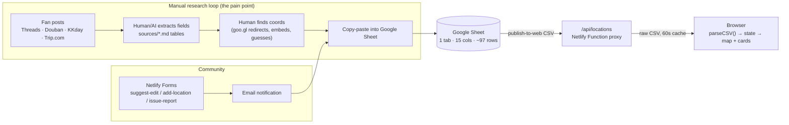
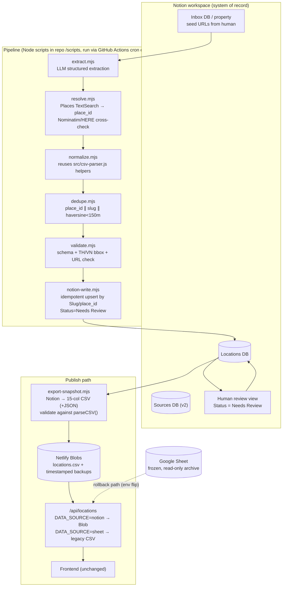

# Notion Migration & Location Automation Plan

> **Project:** lingorm_bangkok_map · **Date:** 2026-07-11 · **Status:** Proposal — no implementation yet
> **Scope:** (1) Evaluate migrating data storage from Google Spreadsheet to Notion; (2) design an automated location-data pipeline (discover → extract → normalize → dedupe → verify → store).

---

## 1. Executive Summary

The current system is a **static Vite site + two read-only Netlify Functions**. All location data lives in **one Google Sheet (1 worksheet, 15 columns, ~97 rows)**, published as CSV and proxied through `/api/locations`. **Nothing in the codebase writes to the sheet** — every insert/update is manual, fed by a manual research workflow (fan posts on Threads/Douban/KKday/Trip.com → hand-built markdown tables in `sources/` → copy-paste into the sheet).

**Verdict (details in §16):**

1. **Migration to Notion is feasible** — the dataset is tiny (~97 rows, well under any Notion limit) and the integration surface is one read-only function.
2. **It is worth it only if Notion becomes the curation workbench**, not just a different place to store the same CSV. The real pain is the manual research/verify/paste loop, and Notion's Status/Relation/view features directly serve that loop. If you only want storage, staying on Sheets is cheaper.
3. **Recommended role: Notion = system of record + curation UI, but the website never reads Notion at request time.** A sync job exports the Notion database to a validated snapshot (same CSV schema at first, JSON later) that `/api/locations` serves. This keeps the site fast, avoids Notion's ~3 req/s rate limit and uptime coupling, and makes rollback trivial.
4. **Location automation can automate ~70–80% of the work** (extraction, geocoding, dedup checks, formatting, writing drafts to Notion). Final verification and Verified-status promotion must stay human — the project's own `sources/coord_verification_report.md` shows why: **14 of 34 manually/LLM-derived coordinates were wrong**, one by 18.8 km.
5. **First experiment:** create the Notion database with 10 migrated rows + a snapshot script that emits the *identical* 15-column CSV the frontend already parses. Zero frontend changes; instant rollback via the existing `GOOGLE_SHEET_CSV_URL`.

---

## 2. Current-State Diagnosis

### 2.1 System inventory (all claims verified against code)

| Component | Evidence | Role |
|---|---|---|
| Static frontend (vanilla JS + Vite 6) | `package.json` (only `vite`, `typescript` devDeps), `src/*.js` (11 modules, 1,892 LOC) | Map UI, card list, filters, i18n (zh/en), favorites |
| `/api/locations` | `netlify/functions/locations.mjs` | **GET-only** proxy: fetches `GOOGLE_SHEET_CSV_URL`, returns raw CSV, `cache-control: max-age=60, stale-while-revalidate=300` |
| `/api/config` | `netlify/functions/config.mjs` | Returns map API keys at runtime |
| CSV parser | `src/csv-parser.js` — `parsePublishedFormat()` | Header-based parsing; **requires** columns `Location Name, Thai / Alt Name, Category, Notes, Source URL, Verification Status, Duplicate Group` |
| Community input | Netlify Forms (`suggest-edit`, `add-location`, `issue-report`) via `src/submit.js` | Write path is **email → human review → manual sheet edit** (documented in `note/TECH_DECISIONS.md`) |
| Research artifacts | `sources/` — `lingorm_location_updated.md`, `Lingorm_Threads_Locations.md`, `coord_verification_report.md`, `Lingorm_Thailand_Locations.py` | The manual pipeline's working files |
| Tests | `tests/*.test.mjs`, node:test, 106 tests; `npm run typecheck` (strict `checkJs`) | Parser, functions, forms, UI covered |

### 2.2 CRUD reality

| Operation | How it happens today | Automated? |
|---|---|---|
| **Create** | Human finds a fan post → extracts fields (sometimes AI-assisted, per `sources/*.md` structure) → pastes row into Google Sheet | ❌ Manual |
| **Read** | Sheet → published CSV → `/api/locations` → `parseCSV()` → `state.data` | ✅ Automated |
| **Update** | Human edits sheet cell (e.g., 2026-06-13 sync log in `sources/lingorm_location_updated.md`) | ❌ Manual |
| **Delete/Hide** | Set `Verification Status = Could Not Find` (hidden from public list, `tests/public-notfound.test.mjs`) | ❌ Manual |
| **Community suggestions** | Netlify Forms → email → human triage → manual sheet edit | ❌ Manual |

### 2.3 What the git history shows

61 commits. Relevant design decisions:

- `9ed9676 → 712687b → 19cf056 → 168a55c` — parser evolved to read the published sheet schema, canonical fields, localized (`ZH`) fields, then `Source Tags`.
- `340d3a1 Remove embedded location fallback` + `4511e2a Support published CSV schema only` — the sheet became the **only** data source; no hardcoded fallback remains.
- `bb96193 Add coordinate verification report` — one-off manual coordinate audit (the 14/34-wrong report).
- `17fefbb / 76b6597` — map provider churn (HERE ↔ Google), showing the data layer stayed stable while presentation changed.

### 2.4 No existing automation

**Fact:** there is no scheduler, crawler, third-party location API client, LLM call, or MCP integration anywhere in the repo (checked `package.json`, `netlify/functions/`, `src/`, `build.sh`). `sources/Lingorm_Thailand_Locations.py` is a one-off `openpyxl` xlsx generator with hardcoded data — a legacy artifact, superseded by the Google Sheet.

### 2.5 Secrets & dependencies

- `.env` / Netlify env vars: `GOOGLE_SHEET_CSV_URL` (treated as secret — kept server-side), `GOOGLE_MAPS_KEY`, `GOOGLE_MAP_ID`, and `HERE_API_KEY`.
- External runtime deps: Google Sheets publish-to-web, Google Maps JS API, HERE Maps JS API, Netlify Forms, GTM/GA4.

### 2.6 API usage boundary — curation-time vs runtime

This plan introduces a **second, distinct** set of Google/HERE credentials for location resolution (§7–§9). They must not be conflated with the existing map-rendering keys above:

| | Curation-time (this plan adds) | Runtime (already exists) |
|---|---|---|
| APIs | Places API (New): Text Search, Place Details; OSM/Nominatim; HERE Geocoding & Search | Google Maps JavaScript API, HERE Maps JS API |
| Key(s) | `GOOGLE_PLACES_KEY` (new) | `GOOGLE_MAPS_KEY`, `GOOGLE_MAP_ID`, `HERE_API_KEY` (existing, served via `/api/config`) |
| Who calls it | Pipeline scripts (`resolve.mjs`), triggered by the maintainer or a GitHub Actions cron | Every visitor's browser, on every page load, to render map tiles/markers |
| Purpose | Resolve a place name/fan-post into a verified `place_id` + coordinates during location intake | Draw the interactive map the visitor sees |
| Exposure | Server-side only — never reaches the browser | Client-side by design (map SDKs require a browser-visible key, scoped/restricted per Google's guidance) |
| Billing | New usage against the Places API free tier (§8, §15 Q2) | Already-provisioned existing cost line, unaffected by this plan |

**Why this matters:** the automation in this plan never adds a runtime dependency for end users — it only adds a background job the maintainer (or a scheduled Action) runs. Site visitors are unaffected either way; the only thing that changes for them is which snapshot file `/api/locations` happens to be serving (§9.1).

---

## 3. Existing Data Flow



Key properties: read path is fully automated and cached; **every write is human**; coordinates are the least reliable field because they are produced by hand.

---

## 4. Spreadsheet Schema Analysis

Live sheet fetched 2026-07-11 (spreadsheet `1ByLH…OTQtM`, first worksheet). **15 columns, ~97 data rows.**

| # | Column | Type (observed) | Notes / issues found in live data |
|---|---|---|---|
| 1 | `Location Name` | text, **de-facto primary key** | Frontend ID = `slugify(name)` — *rename changes identity and silently breaks localStorage favorites* |
| 2 | `Location Name ZH` | text | Fully populated |
| 3 | `Thai / Alt Name` | text | Sparse |
| 4 | `Google Maps URL` | URL | Mix of `maps.app.goo.gl` short links, `?api=1&query=` search URLs, `ftid=` links |
| 5 | `Category` | enum-ish text | Values outside the app's `CATEGORIES` exist (`Other`, `Beverages`); parser patches via `CATEGORY_ALIASES` |
| 6 | `Notes` | long text (EN) | **Empty for ~40 rows** (the `___epoh___` batch has ZH only) |
| 7 | `Notes ZH` | long text | Contains embedded source URLs + multi-line content — schema drift: references live in prose, not in `Source URL` |
| 8 | `Source URL` | URL(s), comma-separated | For the `___epoh___` batch this holds a *Google Maps list link*, not the actual fan post (which is buried in Notes ZH) |
| 9 | `Source Tags` | comma-separated labels | Drift: contains a Threads handle (`___epoh___`) and a duplicate (`Threads, Threads`) |
| 10 | `Verification Status` | enum: `Verified` / `Needs Review` / `Could Not Find` | Normalized defensively in `normalizeStatus()` |
| 11 | `Duplicate Group` | text | **Header required by parser but empty in every row** — designed, never used |
| 12 | `Lat` | decimal string | Placeholder coords repeated across rows (e.g. `13.7450,100.5650` for 4+ different venues) |
| 13 | `Lng` | decimal string | Same issue |
| 14 | `Icon` | emoji | Falls back to `ICON_BY_CAT` |
| 15 | `Coordinates Approx` | `TRUE`/`FALSE` | Honest flag; many TRUE |

No formulas, no validation rules, no cross-sheet references were observed — it is a flat table. **Unique constraint, relations, and status workflow all live in code or in people's heads.**

### Data-quality debts to fix before/during migration

1. ~40 rows missing EN notes (bilingual UI shows ZH fallback).
2. Placeholder/duplicate coordinates flagged `Approx=TRUE` (and historically, `coord_verification_report.md`: 14/34 wrong even among `FALSE` rows).
3. `Source Tags`/`Source URL` semantic drift (handles as tags; maps-list link as source).
4. `Duplicate Group` unused; branch duplicates exist as separate rows (Chagô vs CHAGÔ EmQuartier, two Mil Toast House branches, two Butterbear branches — legitimate branches, but nothing links them).
5. No stable row ID — name is the key.

---

## 5. Notion Feasibility Assessment

### 5.1 Hard constraints (verified against official docs, July 2026)

- **Rate limit:** average **3 requests/second per integration**, with bursts tolerated; HTTP 429 + `Retry-After` on excess; plus a per-workspace cap scaled by plan. [1]
- **Pagination:** query endpoints return max 100 pages per request.
- **Payload/property limits:** each `rich_text` element ≤ 2,000 chars (long notes must be chunked into multiple elements, up to 100 per property); request body ≤ 500 KB / 1,000 blocks; exceeding returns `validation_error` 400 [1]. Several `Notes ZH` cells are multi-hundred-char already — the writer must chunk defensively.
- **Status property options cannot be created/updated via API** — one-time manual UI setup, or use Select [7].
- **Property display order is not controllable via API** (cosmetic only).
- **API version 2025-09-03:** databases became parents of **data sources**; queries moved to `/v1/data_sources/:id/query`. New integrations should target this version; older `database_id`-based code breaks if a DB gains a second data source. [2]
- **No unique constraints or referential integrity** — dedup must be enforced by your pipeline, not the store.
- **No SQL-grade querying** — filters/sorts only; fine at ~100 rows, painful at 10k+.
- **Backup:** no point-in-time restore via API; you must export (which the snapshot pipeline gives you for free).

At ~97 rows and a manual edit cadence, none of these limits bite for storage. They **do** bite if the public site queries Notion per request (cold latency typically hundreds of ms, 3 rps ceiling, availability coupling) — hence the snapshot design.

### 5.2 Option analysis

| Option | Pros | Cons | Verdict |
|---|---|---|---|
| **A. Stay on Google Sheets** | Zero work; publish-to-web CSV is free, cached, reliable | None of the workflow pain is solved; no statuses/relations/review queue; schema drift continues | Baseline — acceptable if automation is dropped |
| **B. Notion as sole source, site reads Notion API at runtime** | One system; always fresh | Latency per page load; 3 rps ceiling; site down when Notion is down; secret handling in function; CORS forces server proxy anyway | ❌ Reject |
| **C. Notion as system of record + published snapshot (recommended)** | Curation UI (statuses, views, relations, comments); site keeps static-speed reads; rollback = flip env var; snapshot doubles as backup | One sync job to build & operate; eventual consistency (minutes, not seconds) | ✅ **Recommend** |
| **D. Real DB (Supabase/Postgres) as SoR, Notion as mirror view** | Real constraints, SQL, scales | Overkill for ~100 rows; two syncs instead of one; more infra to keep alive | Future path if rows × writes grow ~100× |
| **E. Dual-write Sheets + Notion** | "Safety" | Nothing writes to Sheets programmatically today, so dual-write means *humans* doing double entry — guaranteed divergence | ❌ Reject |

**On honesty about Notion as a database:** Notion is a *content workspace* with an API, not a database with transactions. It is a good system of record here **only because** the dataset is small, writes are low-frequency and human-curated, and the read path is decoupled via snapshot. If any of those change (thousands of rows, high-frequency automated writes, multi-writer concurrency), move the SoR to Postgres (Option D) and keep Notion as a view.

### 5.3 Consistency, backup, rollback in Option C

- **Consistency:** one-way flow (Notion → snapshot → site). No dual-write. Sheet becomes read-only archive after cutover.
- **Backup:** every snapshot is a timestamped full export (keep last N in Netlify Blobs or `git`); plus Notion's own trash/page history for row-level recovery.
- **Rollback:** `/api/locations` reads `DATA_SOURCE=sheet|notion` env var; flipping back to `sheet` restores the exact current behavior. **Note:** Netlify env var changes only take effect after a redeploy [6] — rollback is "flip var + trigger redeploy of unchanged code" (~1–2 min), not instant. If true zero-deploy switching is ever needed, read the flag from Netlify Blobs at runtime instead. Keep the sheet frozen but published during a 2–4 week bake period.

---

## 6. Recommended Notion Data Model

**Two databases** (second one optional in MVP):

### 6.1 `Locations` database

| Property | Notion type | Maps from | Notes |
|---|---|---|---|
| `Name` | Title | `Location Name` | Display name (EN) |
| `Slug` | Rich text (or Formula) | `slugify(Location Name)` | **Stable external ID — set once, never auto-recompute after creation**; fixes the rename-breaks-favorites bug |
| `Name ZH` | Rich text | `Location Name ZH` | |
| `Thai / Alt Name` | Rich text | same | |
| `Category` | Select | `Category` | Seed options from `CATEGORIES` in `i18n.js`; run `CATEGORY_ALIASES` normalization during import so aliases die at migration |
| `Icon` | Rich text (emoji) | `Icon` | Could also use Notion page icon; keep property for export fidelity |
| `Notes EN` / `Notes ZH` | Rich text | `Notes` / `Notes ZH` | |
| `Google Maps URL` | URL | same | |
| `Google Place ID` | Rich text | *(new)* | Storable indefinitely per Google policy [4]; primary dedup + revalidation key |
| `Lat` / `Lng` | Number | `Lat`/`Lng` | |
| `Coordinates Approx` | Checkbox | `Coordinates Approx` | |
| `Status` | Status *(options set up manually in UI)* or Select | `Verification Status` | Groups: To do = `Draft`, `Needs Review`; In progress = `Verifying`; Done = `Verified`, `Could Not Find`, `Closed`. **API limitation: status property options/groups cannot be created or updated via the API** [7] — either configure options once by hand in the Notion UI (one-time step in Phase 1), or use a plain Select in MVP |
| `Source URLs` | Rich text (one URL per line) | `Source URL` | Or Relation → `Sources` DB (v2) |
| `Source Tags` | Multi-select | `Source Tags` | Clean the handle/dup drift during import |
| `Duplicate Of` | Relation (self, single) | `Duplicate Group` | Replaces the never-used column with a real link |
| `Branch Group` | Relation (self) or Select | *(new)* | Links branch variants (Mil Toast ×2, Butterbear ×2) |
| `Published` | Formula | — | e.g. `Status != "Could Not Find" and Status != "Draft"` — exporter filters on this |
| `Last Verified` | Date | *(new)* | Set by verification runs; drives "stale data" re-checks |
| `Added By` / `Origin` | Select | *(new)* | `manual` / `pipeline` / `community-form` |
| `Created time` / `Last edited time` | built-in | — | Free audit trail (Sheets had none) |

### 6.2 `Sources` database (v2, optional)

`URL` (title/url), `Platform` (select: Threads/Douban/KKday/Trip.com/IG/YouTube), `Handle`, `Fetched at`, `Raw excerpt`; Relation ← `Locations`. This is where the pipeline records provenance per claim.

### 6.3 Export contract (critical)

The snapshot exporter emits **the current 15-column CSV** (same headers, same order, `Duplicate Group` emitted empty or from relation) **plus one additive `Slug` column** in phase 1. Header-based `parseCSV()` safely ignores unknown columns, so this is non-breaking. The frontend does not change in Phase 1; in Phase 2 the parser gains one line — `id: read(r, "Slug") || slugify(name)` — which decouples location identity from the display name (see §13 Phase 2). JSON becomes an additive v2 (`/api/locations?format=json`) once stable.

---

## 7. Location Automation Feasibility

### 7.1 Pipeline definition

```
seed (fan post URL / venue name / community form)
  → fetch & extract      (LLM-assisted: name, alt names, category, notes, source)
  → resolve place        (deterministic: Places Text Search / Nominatim → place_id, coords, address)
  → normalize            (category aliases, tag rules, bilingual field mapping)
  → dedupe               (slug + place_id + haversine < 150 m + fuzzy name)
  → validate             (schema checks, coord bounding box for TH/VN, URL liveness)
  → write draft to Notion (Status = Needs Review, Origin = pipeline)
  → human review in Notion (promote to Verified / reject)
  → snapshot export → site
  → periodic re-verify   (rows with Last Verified > 90 days: recheck place_id still OPERATIONAL)
```

### 7.2 What already exists and is reusable

- `slugify`, `CATEGORY_ALIASES`, `normalizeStatus`, `normalizeSourceTags`, `ICON_BY_CAT`, `ZH_BY_CAT` (`src/csv-parser.js`) — the normalization layer is written and unit-tested. The pipeline should import these, not reimplement them.
- The 15-column schema and its tests (`tests/parsecsv.test.mjs`, `tests/locations-function.test.mjs`) define the output contract.
- `sources/*.md` field tables are effectively hand-run pipeline outputs — they define the extraction spec.

### 7.3 Evidence-based division of labor

| Step | Automatable? | Evidence / reason |
|---|---|---|
| Discover candidate posts | ⚠️ Semi | Threads/Douban have no usable public APIs; scraping is ToS-fragile. Human drops URLs into an Inbox; automation takes over from there |
| Extract fields from a post | ✅ High | LLMs are strong at structured extraction from prose; `sources/*.md` shows the exact target shape |
| Coordinates / address | ✅ **Must be deterministic API, never LLM** | `coord_verification_report.md`: 14/34 hand/LLM coords wrong, worst 18.8 km off |
| Categorize + bilingual notes draft | ✅ High | LLM draft, human polishes voice |
| Dedup | ✅ High | Deterministic: place_id equality → same place; else haversine + fuzzy name |
| Verify (existence, still open) | ⚠️ Assisted | API `business_status` helps; final call human (fan-context correctness isn't in any API) |
| Promote to Verified / publish | ❌ Human | Editorial judgment; the map's credibility is the product |

**Realistic ceiling: ~70–80% effort reduction.** The human role shifts from data entry to review.

---

## 8. Data Source Comparison

| Source | Quality | Coverage (TH) | Cost | Rate limit | Long-term storage allowed? | Hallucination/error risk | Fit |
|---|---|---|---|---|---|---|---|
| **Google Places API (New)** | Best-in-class POI accuracy | Excellent | Per-SKU free tiers since 2025-03-01 (no more $200 credit); Text Search Pro ~5,000 free calls/mo then ~$32/1,000 [3] | Generous QPS | ⚠️ **No — only `place_id` indefinitely; lat/lng cacheable ≤30 days; other content may not be stored** [4] | Low | ✅ Primary *resolver/validator*; store place_id + your own authored content |
| **OpenStreetMap / Nominatim (public)** | Good geocoding; POI depth varies in BKK | Good | Free | **Abs. max 1 req/s; recurring jobs 4 req/min; caching required** [5] | ✅ Yes (ODbL + attribution) | Low | ✅ Secondary/cross-check geocoder; fine at this volume |
| **HERE Geocoding & Search** | Good | Good | Free tier (project already has HERE key) | Ample | Check plan terms | Low | ✅ Fallback resolver — key already provisioned |
| Official venue sites / IG | Authoritative hours | Spotty | Free | — | Quotes/facts OK | Med (stale pages) | ⚠️ Verification aid only |
| Search engines / scraping | Varies | Varies | Time | ToS-fragile | Murky | Med-high | ❌ Avoid as a systematic source |
| **LLM extraction (from provided post text)** | Good at structure, bad at facts it wasn't given | n/a | ~cents/location | n/a | Your own output | **High if asked to "know" coords/addresses** | ✅ Extraction & drafting only; every factual field cross-checked deterministically |
| Foursquare/OSM Overture datasets | Decent | OK | Free | n/a | ✅ Yes | Low | Optional enrichment later |

**ToS note (important, unverified edge):** storing Google Places *names/addresses/hours* in Notion long-term conflicts with the caching policy [4]. Compliant pattern: store `place_id` + coordinates (refresh ≤30 days or on demand) + **your own** fan-context notes; fetch/display-fresh anything else, or source names/addresses from the fan post itself and OSM. In practice your names already come from fan posts (your own editorial content), so the clean design is: **fan post = content source; Places API = resolver/validator; OSM = storable geocode fallback.**

---

## 9. Recommended Architecture

### 9.1 Target architecture (stable version)



### 9.2 Cross-cutting concerns

| Concern | Design |
|---|---|
| **Idempotency** | Upsert key = `Slug` (primary) + `Google Place ID` (secondary). Re-running any stage on the same input is a no-op; pipeline stages write a content hash to detect changes |
| **Retry** | Exponential backoff honoring `Retry-After` on Notion 429 [1]; per-item try/catch so one bad row never kills a batch; failed items land in a `Pipeline Errors` report |
| **Rate limiting** | Client-side throttle: ≤2 req/s Notion, 1 req/s Nominatim [5] |
| **Logging** | Structured JSON lines per run (run id, stage, item slug, outcome); GitHub Actions artifacts keep 90 days free |
| **Observability** | Each run posts a summary (n new / updated / skipped / failed) — as a Notion page comment or Action summary; alert = Action failure email |
| **Secrets** | `NOTION_API_KEY`, `GOOGLE_PLACES_KEY` in GitHub Actions secrets + Netlify env; never client-side (same discipline as existing `/api/config` pattern) |
| **Backup/restore** | Timestamped snapshot per export retained (last ~30); restore = re-import snapshot CSV to Notion or point Blob at older snapshot |
| **Error handling in serving path** | `/api/locations` falls back to last-known-good Blob; if Blob missing and `DATA_SOURCE=sheet`, legacy behavior |

### 9.3 Version ladder

| Version | Contents | Deliberately excluded |
|---|---|---|
| **MVP** | Notion `Locations` DB; manual-run `export-snapshot.mjs` → Netlify Blob; `/api/locations` env switch; migration import script | No Sources DB, no LLM stage, no cron — human still adds rows, but in Notion |
| **Stable daily** | Cron for export — GitHub Actions **or Netlify Scheduled Functions** (same platform as the site, one fewer system; Actions wins if you want free log retention + manual dispatch UI); `resolve.mjs` + `dedupe.mjs` + `validate.mjs`; Inbox → draft automation; run summaries | No scraping, no webhook push |
| **Future** | Sources DB + per-claim provenance; Notion webhooks → instant re-export; periodic re-verification of stale rows; community form auto-triage into Inbox; Supabase SoR if scale demands | — |

**Anti-overengineering rule:** every stage is a standalone Node script runnable locally with `node scripts/<stage>.mjs` — no queue, no framework, no server. At ~100 rows and a few writes/week, cron + scripts is the correct amount of architecture.

---

## 10. Migration Strategy

1. **Inventory & freeze point** — export the sheet to `data/migration/source-YYYYMMDD.csv`; commit it (it's public data already). Row count recorded (~97).
2. **Schema mapping** — as §6; codify in `scripts/migrate-sheet-to-notion.mjs`.
3. **Cleaning pass (in the script, logged, not silent):** apply `CATEGORY_ALIASES`; split multi-URL `Source URL`; strip handle-like `Source Tags` into an `Added By` field; flag rows with placeholder coords (`Approx=TRUE` + coord repeated across rows) into `Status=Needs Review`.
4. **Dedup pass** — slug collisions and haversine < 150 m pairs → report, human decides (expect branch cases only).
5. **Test migration** — 10 representative rows (incl. multi-line ZH notes, Thai names, emoji, `Could Not Find` row) → verify in Notion UI + export snapshot → **byte-compare parse result**: `parseCSV(snapshot)` deep-equals `parseCSV(original)` for those rows.
6. **Full migration** — all rows; produce reconciliation report (per-row field diff).
7. **Incremental window** — sheet stays authoritative for ≤1 week; any sheet edit during window is re-applied by re-running the (idempotent) migration script.
8. **Verification** — full snapshot vs sheet CSV: same row count, same parsed objects (order-insensitive), tests green.
9. **Cutover** — set `DATA_SOURCE=notion` in Netlify; watch for one bake period.
10. **Rollback** — flip `DATA_SOURCE=sheet` (sheet still published) + trigger a redeploy of unchanged code (Netlify requires a redeploy for env changes to take effect [6]); total ~1–2 minutes.
11. **Archive** — after bake: sheet marked "ARCHIVED — edit in Notion" in tab name, sharing set read-only, publish-to-web kept alive for one more month, then revoked.

---

## 11. Testing Strategy

| Layer | Tests |
|---|---|
| **Unit** | Mapping functions (sheet row → Notion properties → CSV row); dedup predicates (slug, haversine, fuzzy name); cleaning rules (tag drift, multi-URL split); coordinate bbox validator |
| **Integration** | `export-snapshot.mjs` against a **test Notion database** (separate DB id in CI secrets); `/api/locations` served from Blob vs sheet parity |
| **Notion API contract** | Pin API version `2025-09-03`; a smoke test that creates/queries/archives one page in the test DB and asserts property shapes — catches Notion-side breaking changes [2] |
| **Migration validation** | Golden test: `parseCSV(exported)` deep-equals `parseCSV(source)` on the frozen migration CSV (lat/lng compared as numbers, not strings — see Phase 1); row-count and status-distribution assertions |
| **Idempotency** | Run migration/upsert twice → second run reports 0 creates, 0 updates |
| **Rate limit / retry** | Mock 429 + `Retry-After` → assert backoff + eventual success; mock 529 |
| **Partial failure** | Batch of 10 with 1 poisoned row → 9 succeed, 1 reported, exit code signals partial |
| **Conflict / dirty data** | Missing required fields, coords outside TH/VN bbox, duplicate slug, HTML in fields → rejected into error report, never written |
| **Human review flow** | Draft page → status change → next export includes/excludes correctly (`Published` formula test) |
| **Rollback** | Flip `DATA_SOURCE=sheet` in a preview deploy → old behavior byte-identical (existing `locations-function.test.mjs` extended) |
| **Existing suite** | All 106 node:test tests + `npm run typecheck` stay green throughout — frontend contract unchanged until Phase 4 |

---

## 12. Security & Privacy Risks

1. **Notion token scope** — use an internal integration shared with *only* the two databases; token in Netlify/GitHub secrets. Compromise blast radius = this map's data.
2. **Public data stays public-appropriate** — the map publishes fan-sourced venue info; the pipeline must not ingest personal data from posts (author handles are already borderline — keep them as provenance, never render publicly beyond current behavior).
3. **Google Places ToS** — storage restrictions (§8) [4]; keep stored fields to place_id + own content + ≤30-day coords refresh, or rely on OSM for storable geocodes.
4. **Scraping ToS** — Threads/Douban scraping is against ToS; design keeps a human in the loop for discovery (paste URL → pipeline fetches that page once, as a user-directed fetch).
5. **Prompt injection via fan posts** — LLM extraction consumes untrusted text; treat output as data (JSON schema-validated), never as instructions; no tool-calling in the extraction step.
6. **Secrets hygiene** — existing pattern is good (runtime env, never bundled); pipeline follows it. `.env` already gitignored.
7. **Snapshot integrity** — exporter validates against schema before overwriting last-known-good; corrupted export can't take the site down.

---

## 13. Phased Implementation Plan

> Effort scale: S < 2 h · M = half-day · L = 1–2 days. "Agent fit" = which model/tool suits the work.

### Phase 0 — Confirmations & decisions (S)

| | |
|---|---|
| **Goal** | Lock decisions that shape everything downstream |
| **Confirmed already** | Schema (live CSV), read-only code path, no existing automation, row count ~97, Notion connector available in Cowork |
| **Open decisions** | ① Notion workspace/page to host the DBs; ② adopt Places API (billing account, ToS posture) vs OSM-only MVP; ③ snapshot store: Netlify Blobs vs committed file in repo (Blobs recommended — no deploy per data change; committed file is simpler + versioned); ④ keep CSV as v1 contract (recommended) vs jump to JSON |
| **Risk** | Deciding Notion roles by preference instead of workflow need — mitigated by §5.2 |
| **Agent fit** | Human (you) decides; 10 minutes |

### Phase 1 — Proof of Concept (M)

| | |
|---|---|
| **Goal** | Prove the two riskiest links: Notion round-trip fidelity and deterministic place resolution |
| **Work items** | Create `Locations` DB (schema §6.1); import 10 representative rows; `export-snapshot.mjs` (Notion → 15-col CSV); golden parse-equality test; `resolve.mjs` spike: 5 venues → place_id + coords via Places/Nominatim, compare against sheet coords |
| **Dependencies** | Phase 0 decisions ①③ |
| **Acceptance** | `parseCSV(snapshot)` ≡ `parseCSV(source)` for the 10 rows, **with `lat`/`lng` compared numerically** — the sheet stores 7-decimal strings with trailing zeros (`13.7811000`) which a Number property round-trip emits as `13.7811`; exporter should format with `toFixed(7)` and the test should compare `parseFloat` values; resolver returns correct coords for ≥4/5 test venues (validated against known-good rows like Dear December Cafe; use `regionCode=TH` + location bias for Thai names) |
| **Risks** | Notion rich-text nuances (multi-line ZH notes, emoji) mangling round-trip — that's exactly what the golden test catches |
| **Agent fit** | **Sonnet/Codex**: scripts + tests (mechanical, well-specified). **Fable/Opus**: schema review. Notion DB creation can be done directly via the Cowork Notion connector |

### Phase 2 — Data migration (M)

| | |
|---|---|
| **Goal** | All ~97 rows in Notion; site still on sheet |
| **Work items** | `migrate-sheet-to-notion.mjs` (idempotent upsert + cleaning log §10.3); dedup report; full reconciliation diff; `/api/locations` env-switch + Blob read; preview deploy on `DATA_SOURCE=notion`; **ID fix (must ship before cutover):** exporter emits additive `Slug` column; `csv-parser.js` prefers it — `id: read(r, "Slug") || slugify(name)` — so renames in Notion no longer break localStorage favorites or shared `#fav` URLs; migration sets `Slug = slugify(current name)` once, frozen thereafter; validate step rejects duplicate slugs (Notion has no unique constraint) |
| **Dependencies** | Phase 1 green |
| **Acceptance** | Reconciliation diff = only intended cleanings; idempotency test (2nd run = 0 writes); preview site visually identical; 106 tests + typecheck green; **rename test:** rename a location in Notion → re-export → its `id` (Slug) unchanged, favorites referencing it still resolve; duplicate-slug input rejected by validator |
| **Risks** | Sheet edited mid-migration (mitigate: freeze announcement + re-run); slug collisions (report shows none expected, verify) |
| **Agent fit** | **Sonnet/Codex** for scripts; **human** signs off the reconciliation diff |

### Phase 3 — Location automation (L)

| | |
|---|---|
| **Goal** | Repeatable seed→draft pipeline |
| **Work items** | Inbox convention (Notion DB or property); `extract.mjs` (LLM, JSON-schema-validated output); `resolve.mjs` hardened (Places primary, Nominatim/HERE cross-check, disagreement >150 m → flag); `normalize.mjs` reusing `csv-parser.js` helpers; `dedupe.mjs`; `validate.mjs`; `notion-write.mjs` (Status=Needs Review, Origin=pipeline); GitHub Actions manual-dispatch workflow; run-summary reporting |
| **Dependencies** | Phase 2 (DB is live SoR for drafts even before cutover) |
| **Acceptance** | Feed 5 real fan-post URLs → ≥4 correct drafts in Needs Review with correct coords and no dupes; poisoned input lands in error report; re-run = no dup drafts |
| **Risks** | LLM field hallucination (mitigate: extraction limited to text it's given + schema validation); Places ToS drift (§12.3); Threads page fetch fragility (human pastes text as fallback input mode) |
| **Agent fit** | **Fable/Opus**: pipeline design review + prompt design. **Sonnet/Codex**: implementation. **Human**: review the 5-URL acceptance run |

### Phase 4 — Cutover (S–M)

| | |
|---|---|
| **Goal** | Notion becomes SoR in production |
| **Work items** | Flip `DATA_SOURCE=notion`; verify the committed snapshot in production; bake 2–4 weeks; archive sheet (§10.11); README/TECH_DECISIONS update; rollback drill (actually flip back once in preview) |
| **Acceptance** | Zero user-visible change; production serves the validated committed snapshot; the manual Notion update/deployment workflow is documented; rollback drill passes |
| **Risks** | Silent export failure → stale data (mitigate: last-known-good + failure alert); favorite-slug regressions (mitigate: Slug property frozen at migration) |
| **Agent fit** | **Sonnet** for chores; **human** flips the switch |

### Post-migration TODO — automatic Notion-to-production updates

Automatic synchronization is deliberately deferred until after the migration
and production cutover. In the committed-snapshot MVP, editing Notion alone
does not update production: `data/locations.csv` must be exported, validated,
committed, previewed, and deployed. No raw `NOTION_API_KEY` is currently
configured; migration writes and reads have used the approved Notion connector.

After full migration:

1. Create a least-privilege Notion integration and store `NOTION_API_KEY` and
   `NOTION_DATA_SOURCE_ID` as deployment secrets.
2. Add an Actions cron (target cadence: every 6 hours) that exports to a
   candidate snapshot, validates it, and preserves the last-known-good file on
   failure.
3. Add failure and stale-snapshot alerts.
4. Retain the last 30 timestamped snapshots.
5. Require one full week of scheduled exports with zero failed runs before
   declaring automatic synchronization operational.

---

## 14. Acceptance Criteria (program-level)

1. Public site behavior and visuals unchanged after cutover (existing 106-test suite + manual smoke on live URL).
2. Any sheet-era row is traceable to its Notion page (Slug preserved 1:1); localStorage favorites survive.
3. A new location goes from pasted fan-post URL to reviewable Notion draft in one command / one workflow dispatch, in < 5 minutes, with deterministic coords.
4. No automated write ever publishes directly: pipeline output is always `Needs Review`.
5. Rollback from Notion to sheet demonstrated in ≤ 5 minutes (env flip + redeploy of unchanged code — no code change).
6. Until post-migration automatic synchronization is implemented, every Notion data change follows the documented manual export, validation, preview, and deployment workflow.

---

## 15. Open Questions

1. **Which Notion workspace/page** should host the databases? (Connector is already available in Cowork — I can create the PoC DB on request.)
2. **Google Places billing**: are you comfortable enabling a billed GCP API with the per-SKU free tier (~5k Text Search Pro calls/mo free [3] — your volume is ~tens/month), or should MVP be OSM/HERE-only?
3. **Snapshot store**: Netlify Blobs (runtime, no deploys) vs committed `data/locations.csv` (simpler, git-versioned, but a deploy per data refresh)? Recommendation: committed file for MVP, Blobs when cron lands.
4. **Community forms**: keep Netlify Forms → email, or point form handling at the pipeline Inbox in Phase 3+ (auto-create Draft rows)? Keeping Forms as-is for MVP is recommended.
5. **`Duplicate Group` semantics**: retire it in favor of a `Duplicate Of` relation? Verified: `render.js:169` renders `row.dup` as a card badge when non-empty, but the column is empty in every live row — the exporter must keep emitting the column (parser requires the header); whether to populate it from the relation is your call.
6. Who besides you edits Notion? (Affects workspace permissions and whether Status changes need an approval convention.)

---

## 16. Final Recommendation — Direct Answers

| # | Question | Answer |
|---|---|---|
| 1 | **Migration feasible?** | **Yes.** ~97 rows, one read-only integration point, stable schema. Technical risk is low and contained by the snapshot contract |
| 2 | **Worth migrating?** | **Yes, if and only if you also adopt the curation workflow** (statuses, review queue, pipeline drafts). As pure storage swap: no — Sheets is fine |
| 3 | **Notion's role?** | **System of record + curation/review UI. Never the runtime read path.** Site reads a validated snapshot; Sheets becomes a frozen archive; Postgres only if scale grows ~100× |
| 4 | **How much automation?** | **~70–80% of per-location effort**: extraction, geocoding, normalization, dedup, draft-writing, publishing, stale-data re-checks — all automatable with deterministic validation |
| 5 | **What stays human?** | Source discovery/triage (paste URLs), final verification & promotion to `Verified`, editorial voice of bilingual notes, dedup edge decisions, the cutover switch |
| 6 | **First minimal experiment?** | **Phase 1 PoC**: Notion DB + 10 rows + snapshot exporter + golden parse-equality test, plus a 5-venue resolver spike. One afternoon; validates both risky assumptions before any commitment |
| 7 | **Risks that could kill it?** | ① Google Places storage ToS makes the compliant design more annoying than expected (fallback: OSM/HERE-only); ② Notion round-trip mangles CJK/emoji/multi-line rich text (golden test exposes this in Phase 1 — if it fails badly, stay on Sheets and build automation *against Sheets API* instead); ③ single-maintainer operational load: a cron pipeline you stop maintaining is worse than manual paste (mitigation: manual-dispatch-only until value is proven); ④ Threads/Douban access friction pushes discovery cost back to human — accept, it was always human |

### Facts vs inference vs assumption

- **Facts (verified in code/data):** read-only data path; 15-column schema; ~97 rows; slug-as-ID; unused `Duplicate Group`; manual write workflow; coordinate error history (14/34); no existing automation; test/typecheck setup.
- **Evidence-based inferences:** manual research loop is the dominant cost (from `sources/` artifacts and their timestamps); coordinate quality is the top data risk; renaming a location breaks favorites *and previously shared favorite links* (`favorites.js` persists slug IDs to localStorage and the URL).
- **Unverified assumptions:** Notion rich-text round-trip fidelity for CJK/multi-line (Phase 1 test target); Places resolver accuracy for Thai fan-venue names (Phase 1 spike target); your future edit cadence stays low-volume; no second editor with conflicting workflow.

---

## 17. Schema Adjustments (post-Phase 1, 2026-07-18)

Before starting the Phase 2 full migration, reviewed the §6.1 schema against
what Phase 1/2 actually use vs. what was speculative for Phase 3+. Two
changes made to the live "Locations (PoC)" data source (both non-destructive
— either can be re-added with a single `ADD COLUMN`):

1. **Dropped `Last Verified` (Date).** No process reads or writes it until
   the Phase 3 periodic re-verification cron exists (§9.3 "Stable daily").
   Re-add via `ADD COLUMN "Last Verified" DATE` when that cron is built.
2. **Replaced the `Icon` (rich text) property with Notion's native page
   icon.** The rich-text property was invisible anywhere in the Notion UI
   except inside each individual page — it never showed in database table/
   gallery views, so it added a property without adding any browsing value.
   Native page icons show automatically in every view. `scripts/export-snapshot.mjs`
   now reads `page.icon.emoji` instead of a property.

Kept, despite being empty in the Phase 1 PoC rows, because Phase 2 populates
them as part of migration itself (not speculative Phase 3+ scaffolding):
`Google Place ID` (filled by running `resolve.mjs` during migration —
§7.1, §13 Phase 3 work item pulled forward), `Origin` (migration batch
tagged `manual`, distinguishes it from later `pipeline`/`community-form`
rows), `Branch Group` (the §10 migration dedup pass is explicitly meant to
populate this for known branch cases like Mil Toast House ×2, Butterbear ×2).

---

## 18. Progress Log — Phase 2 execution (2026-07-18)

**Status: data migration, Google Place ID population, and ID fix done; env-switch not started.**

### Done

- All **98/98 rows** migrated into the "Locations (PoC)" Notion data source (10 from the Phase 1 PoC + 88 from this session, submitted in 3 batches via `notion-create-pages`).
- Cleaning pass applied and logged (`migration-output/cleaning-log.md`, gitignored — regenerate via `scripts/migrate-sheet-to-notion.mjs data/migration/source-20260718.csv --existing-slugs data/migration/source-20260718.csv`; using the reconciled source as the existing-slug snapshot is valid now that all 98 rows are confirmed present):
  - 3 `Category` alias fixes.
  - 55 rows: `Source Tags` `"___epoh___"` → `"Threads"` (plan §4 issue 3).
  - 2 placeholder-coordinate clusters detected → 3 rows downgraded `Verified` → `Needs Review` (plan §4 issue 2).
- Branch Group linked for all 4 known duplicate pairs (Mil Toast House, Butterbear Cafe, Chin Bo Dang, Chagô) — 8 rows, including one `notion-update-page` call for the already-existing Phase 1 PoC row.
- Reconciliation checks (plan §10 step 8, §11 "Migration validation"):
  - Row count: 98 in Notion = 98 in frozen source. ✅
  - Status distribution: 81 Verified / 16 Needs Review / 1 Could Not Find, sums to 98. ✅
  - No slug collisions (`GROUP BY Slug HAVING n > 1` returns empty), including the two degenerate slugs `10` and `by` produced by Thai-only names. ✅
  - Branch Group pairs: 4/4 correctly linked. ✅
- §17 schema trims (Last Verified dropped, Icon → native page icon) carried through migration without incident.

### Update (2026-07-18, later same day) — Google Place ID populated

97/98 rows now have `Google Place ID` written (all except the "by" slug — see below).
`resolve.mjs`'s POST endpoint is unreachable from the agent sandbox (no route
to `places.googleapis.com`), and even the legacy GET endpoint returned
`REQUEST_DENIED` from the sandbox specifically — confirmed not a key-config
issue since the same URL/key succeeded via the user's own `curl` and browser
at the same time. Root cause not fully diagnosed (likely the sandbox's
outbound fetch path attaches something Google's referrer check rejects, or
routes through an edge node with stale key-restriction cache) — logged here
so a future session doesn't re-debug the key from scratch.

Resolution: wrote `scripts/resolve-legacy-batch.mjs`, run by the user
locally against the legacy Text Search GET endpoint (confirmed working
there), with location-bias from each row's stored Lat/Lng. Output
(`migration-output/place-id-resolution.json`, `place-id-report.md`) read
back and written into Notion via 97 individual `notion-update-page` calls.

**Findings from the run, not yet acted on:**
- **41/98 rows** resolved to a place >150m from the row's stored Lat/Lng
  (full list in `migration-output/place-id-report.md`) — some are large
  (18–95 km), consistent with the plan's own finding that hand-entered
  coordinates are unreliable (§4 debt #2, the 14/34-wrong report). Lat/Lng
  were **not** auto-corrected — Place ID only. A follow-up pass should
  decide, per row, whether to trust the Places result and update Lat/Lng.
- **One resolver false-match**: the row `by` (ข้ามันบ้านนอก by
  บ้านนอกคอกนาเขาใหญ่, a fried-rice/chicken shop) and `cafe-ban-nok-by-ple-venus`
  (an unrelated cafe) resolved to the identical Place ID — a genuine
  different venue, not one of the 4 known branch-duplicate pairs. Left
  `Google Place ID` **blank** on the `by` row rather than write a wrong ID;
  needs a manually-refined query (e.g. add a landmark/district hint) or
  manual lookup.
- `resolve.mjs` was refactored to remove a top-level env-var guard that
  made it un-importable — `haversineMeters` is now safely reusable from
  other scripts without requiring `GOOGLE_PLACES_KEY` at import time.

### Update (2026-07-18, later same day) — ID fix shipped

`src/csv-parser.js` now resolves `id: read(r, "Slug") || slugify(name)` —
a Notion rename no longer changes a location's id, so localStorage
favorites and shared `#fav` URLs survive renames (plan §13 Phase 2, §14
acceptance #2). Backward compatible: the legacy sheet format has no `Slug`
column, so `read(r, "Slug")` returns `""` and every existing row falls
through to `slugify(name)` exactly as before — confirmed by the full
existing test suite staying green. Added 4 new tests to
`tests/parsecsv.test.mjs` covering: Slug preferred when present, id stays
frozen across a simulated rename, fallback when Slug column is absent
(legacy format), fallback when Slug column exists but is empty for a row.
The full suite stayed green at this checkpoint; later snapshot and safety regression coverage brings the total to 106 tests.

### Update (2026-07-18, later same day) — migration safety fixes

- `migrate-sheet-to-notion.mjs` now requires `--existing-slugs <csv|json|txt>` and skips rows found in that explicit snapshot instead of relying on a hard-coded 10-row PoC list. A repeated run against the current 98-row snapshot emits zero creates or updates.
- Duplicate slugs now stop the migration before payload files are written.
- `resolve.mjs` flags missing stored or resolved coordinates for review instead of allowing `NaN` comparisons to appear clean.
- `export-snapshot.mjs` validates credentials only when executed, so its serializers can be imported and tested without secrets.
- Added migration safety regression coverage; the later snapshot work brings the full suite to **106/106 passing**, typecheck clean.

### Update (2026-07-18, Phase 2 snapshot read path and full reconciliation)

- `/api/locations` now supports `DATA_SOURCE=sheet|notion`. `sheet` keeps the
  legacy proxy unchanged; `notion` serves the validated, bundled
  `data/locations.csv` snapshot. The committed-file MVP was chosen over Blobs
  until the scheduled export job exists, preserving simple versioned rollback.
- Netlify bundles the snapshot with the function, and `build.sh` validates only
  the environment required by the selected source.
- A repaired Notion UI export was converted to the stable 16-column contract.
  Reconciliation found 36 connector-import text corruptions across 29 rows;
  all were repaired in Notion and re-read before the final export.
- The manual converter now rejects incomplete exports as well as duplicate
  slugs, and the Netlify build validates the stable header contract, exact
  98-row baseline, nonempty slugs, and uniqueness before deployment.
- `tests/notion-export-full.test.mjs` validates all 98 rows against the frozen
  migration source when present. All fields match after the documented
  cleanings: 56 raw `___epoh___` tags become `Threads`, duplicate/source-tag
  order is normalized by Notion multi-select, and three rows were deliberately
  downgraded from `Verified` to `Needs Review`.
- **106/106 tests pass**, typecheck and production build are clean.

### Still open before production cutover

1. **Preview deploy on `DATA_SOURCE=notion`**, followed by the rollback drill
   (`DATA_SOURCE=sheet`) required by §13.
2. **41 rows flagged >150m** and **1 row (`by`) with no Google Place ID** — see
   the update above; both need a human decision, not automated writes.

---

## References

- [1] Notion API — Request limits (avg 3 req/s per integration, 429 + Retry-After) — https://developers.notion.com/reference/request-limits
- [2] Notion API — Upgrade guide, version 2025-09-03 (data sources, `/v1/data_sources/:id/query`) — https://developers.notion.com/guides/get-started/upgrade-guide-2025-09-03
- [3] Google Maps Platform — Places API usage & billing (per-SKU free tiers since 2025-03-01; Text Search Pro pricing) — https://developers.google.com/maps/documentation/places/web-service/usage-and-billing
- [4] Google Maps Platform — Places API policies (no caching/storage except place_id indefinitely; coords ≤30 days) — https://developers.google.com/maps/documentation/places/web-service/policies
- [5] OSMF — Nominatim usage policy (abs. max 1 req/s; recurring jobs 4 req/min; caching required) — https://operations.osmfoundation.org/policies/nominatim/
- [6] Netlify Support — env var changes require a redeploy to take effect — https://answers.netlify.com/t/when-changing-environment-variables-is-it-necessary-to-re-deploy-for-changes-to-take-effect/14089
- [7] Notion API — Update database properties (status options/name cannot be updated via API) — https://developers.notion.com/reference/update-property-schema-object
