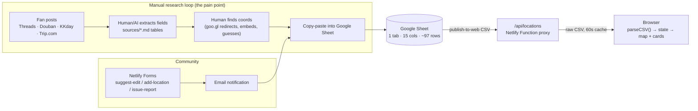
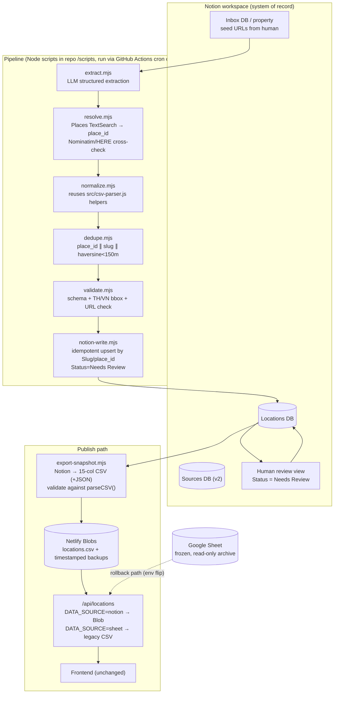

# Notion 遷移與地點自動化計畫

> **專案：** lingorm_bangkok_map · **日期：** 2026-07-11 · **狀態：** 提案 — 尚未實作
> **範圍：** (1) 評估將資料儲存從 Google Spreadsheet 遷移至 Notion；(2) 設計自動化地點資料流程（發掘 → 擷取 → 正規化 → 去重 → 驗證 → 儲存）。

---

## 1. 摘要

目前系統是一個**靜態 Vite 網站 + 兩個唯讀的 Netlify Functions**。所有地點資料存放在**單一 Google Sheet（1 個工作表、15 欄、約 97 列）**，以 CSV 形式發佈，並透過 `/api/locations` 代理存取。**程式碼庫中沒有任何地方會寫入該 sheet** —— 每一筆新增/更新都是人工完成，來源是手動的研究流程（Threads/Douban/KKday/Trip.com 上的粉絲貼文 → 手動整理成 `sources/` 中的 markdown 表格 → 複製貼上到 sheet）。

**結論（詳見 §16）：**

1. **遷移到 Notion 是可行的** —— 資料集很小（約 97 列，遠低於任何 Notion 限制），且整合面只有一個唯讀 function。
2. **只有當 Notion 成為策展工作台時才值得做**，而不只是換個地方存放同樣的 CSV。真正的痛點是手動研究/驗證/貼上的循環，而 Notion 的 Status/Relation/view 功能正好對應這個循環。如果只是要換個儲存位置，繼續用 Sheets 更划算。
3. **建議角色：Notion = 系統記錄（system of record）+ 策展 UI，但網站永遠不在請求時讀取 Notion。** 由一個同步任務將 Notion database 匯出為經驗證的快照（初期沿用同樣的 CSV schema，之後再改 JSON），供 `/api/locations` 讀取。這樣能維持網站速度、避開 Notion 約 3 req/s 的速率限制與可用性耦合，並讓回滾變得很簡單。
4. **地點自動化可以自動化約 70–80% 的工作**（擷取、地理編碼、去重檢查、格式化、將草稿寫入 Notion）。最終驗證與升級為 Verified 狀態必須維持人工 —— 專案自己的 `sources/coord_verification_report.md` 說明了原因：**34 筆人工/LLM 推算座標中有 14 筆是錯的**，最嚴重偏差達 18.8 公里。
5. **第一個實驗：** 建立 Notion database，遷移 10 列資料，並寫一個快照腳本輸出前端已經在解析的、*完全相同*的 15 欄 CSV。前端零改動；透過現有的 `GOOGLE_SHEET_CSV_URL` 即可立即回滾。

---

## 2. 現況診斷

### 2.1 系統盤點（所有陳述皆已對照程式碼驗證）

| 元件 | 證據 | 角色 |
|---|---|---|
| 靜態前端（vanilla JS + Vite 6） | `package.json`（devDeps 只有 `vite`、`typescript`）、`src/*.js`（11 個模組，1,892 行） | 地圖 UI、卡片列表、篩選、i18n（zh/en）、收藏 |
| `/api/locations` | `netlify/functions/locations.mjs` | **僅 GET** 的代理：抓取 `GOOGLE_SHEET_CSV_URL`，回傳原始 CSV，`cache-control: max-age=60, stale-while-revalidate=300` |
| `/api/config` | `netlify/functions/config.mjs` | 執行期回傳地圖 API 金鑰 |
| CSV 解析器 | `src/csv-parser.js` — `parsePublishedFormat()` | 以標頭為基礎解析；**要求**欄位 `Location Name, Thai / Alt Name, Category, Notes, Source URL, Verification Status, Duplicate Group` |
| 社群輸入 | 透過 `src/submit.js` 的 Netlify Forms（`suggest-edit`、`add-location`、`issue-report`） | 寫入路徑是**email → 人工審核 → 手動編輯 sheet**（記錄於 `note/TECH_DECISIONS.md`） |
| 研究產出物 | `sources/` —— `lingorm_location_updated.md`、`Lingorm_Threads_Locations.md`、`coord_verification_report.md`、`Lingorm_Thailand_Locations.py` | 手動流程的工作檔案 |
| 測試 | `tests/*.test.mjs`，node:test，73 個測試；`npm run typecheck`（strict `checkJs`） | 涵蓋解析器、functions、表單、UI |

### 2.2 CRUD 現實

| 操作 | 目前如何發生 | 是否自動化？ |
|---|---|---|
| **建立** | 人工找到粉絲貼文 → 擷取欄位（依 `sources/*.md` 的結構，有時借助 AI） → 貼進 Google Sheet | ❌ 手動 |
| **讀取** | Sheet → 發佈的 CSV → `/api/locations` → `parseCSV()` → `state.data` | ✅ 自動 |
| **更新** | 人工編輯 sheet 儲存格（例如 `sources/lingorm_location_updated.md` 中 2026-06-13 的同步紀錄） | ❌ 手動 |
| **刪除/隱藏** | 設定 `Verification Status = Could Not Find`（從公開列表隱藏，見 `tests/public-notfound.test.mjs`） | ❌ 手動 |
| **社群建議** | Netlify Forms → email → 人工分流 → 手動編輯 sheet | ❌ 手動 |

### 2.3 Git 歷史顯示的資訊

61 個 commits。相關的設計決策：

- `9ed9676 → 712687b → 19cf056 → 168a55c` —— 解析器逐步演進以讀取發佈的 sheet schema、標準欄位、本地化（`ZH`）欄位，最後是 `Source Tags`。
- `340d3a1 Remove embedded location fallback` + `4511e2a Support published CSV schema only` —— sheet 成為**唯一**資料來源；不再保留任何硬編碼 fallback。
- `bb96193 Add coordinate verification report` —— 一次性的人工座標稽核（14/34 錯誤的報告）。
- `17fefbb / 76b6597` —— 地圖供應商更迭（HERE ↔ Google），顯示資料層維持穩定，只有呈現層在變動。

### 2.4 目前沒有任何自動化

**事實：** 整個 repo（已檢查 `package.json`、`netlify/functions/`、`src/`、`build.sh`）中沒有排程器、爬蟲、第三方地點 API 客戶端、LLM 呼叫或 MCP 整合。`sources/Lingorm_Thailand_Locations.py` 是一個一次性的 `openpyxl` xlsx 產生器，資料是硬編碼的 —— 屬於已被 Google Sheet 取代的舊產出物。

### 2.5 機密資訊與相依項

- `.env` / Netlify 環境變數：`GOOGLE_SHEET_CSV_URL`（視為機密，僅保留在伺服端）、`GOOGLE_MAPS_KEY`、`GOOGLE_MAP_ID`、`HERE_API_KEY`、選用的 `ADMIN_PASSWORD`（該功能已在 `e33bca5` 移除）。
- 外部執行期相依：Google Sheets 發佈到網頁、Google Maps JS API、HERE Maps JS API、Netlify Forms、GTM/GA4。

### 2.6 API 使用邊界 —— 整理階段 vs 執行階段

本計畫為地點解析（§7–§9）引入**第二組、性質不同**的 Google/HERE 憑證。切勿與上方既有的地圖渲染金鑰混為一談：

| | 整理階段（本計畫新增） | 執行階段（既有） |
|---|---|---|
| API | Places API (New)：Text Search、Place Details；OSM/Nominatim；HERE Geocoding & Search | Google Maps JavaScript API、HERE Maps JS API |
| 金鑰 | `GOOGLE_PLACES_KEY`（新增） | `GOOGLE_MAPS_KEY`、`GOOGLE_MAP_ID`、`HERE_API_KEY`（既有，透過 `/api/config` 提供） |
| 由誰呼叫 | Pipeline 腳本（`resolve.mjs`），由維護者或 GitHub Actions cron 觸發 | 每位訪客的瀏覽器，每次載入頁面時，用來渲染地圖圖磚/標記點 |
| 用途 | 在納入地點資料時，把地點名稱/粉絲貼文解析成經驗證的 `place_id` + 座標 | 繪製訪客看到的互動式地圖 |
| 曝光範圍 | 僅在伺服端，絕不會傳到瀏覽器 | 依設計就是要在客戶端使用（地圖 SDK 需要瀏覽器可見的金鑰，依 Google 指引做範圍限制） |
| 計費 | 新產生的用量，計入 Places API 免費額度（§8、§15 問題 2） | 已經在使用的既有成本項目，不受本計畫影響 |

**為什麼這點很重要：** 本計畫的自動化流程，永遠不會為一般使用者增加執行期的相依性 —— 它只是新增一個由維護者（或排程的 Action）執行的背景作業。無論如何，網站訪客都不受影響；對他們來說唯一改變的只有 `/api/locations` 當下讀取的是哪一份快照檔案（§9.1）。

---

## 3. 現有資料流



關鍵性質：讀取路徑完全自動化且有快取；**每一次寫入都是人工**；座標是最不可靠的欄位，因為是手動產生的。

---

## 4. Spreadsheet Schema 分析

即時 sheet 於 2026-07-11 抓取（spreadsheet `1ByLH…OTQtM`，第一個工作表）。**15 欄，約 97 筆資料列。**

| # | 欄位 | 型別（觀察所得） | 現有資料中發現的備註/問題 |
|---|---|---|---|
| 1 | `Location Name` | 文字，**事實上的主鍵** | 前端 ID = `slugify(name)` —— *改名會改變識別碼，並悄悄破壞 localStorage 收藏功能* |
| 2 | `Location Name ZH` | 文字 | 完整填寫 |
| 3 | `Thai / Alt Name` | 文字 | 稀疏 |
| 4 | `Google Maps URL` | URL | 混雜 `maps.app.goo.gl` 短連結、`?api=1&query=` 搜尋 URL、`ftid=` 連結 |
| 5 | `Category` | 類 enum 文字 | 存在超出應用程式 `CATEGORIES` 之外的值（`Other`、`Beverages`）；解析器透過 `CATEGORY_ALIASES` 修補 |
| 6 | `Notes` | 長文字（EN） | **約 40 列為空**（`___epoh___` 這批只有 ZH） |
| 7 | `Notes ZH` | 長文字 | 內嵌來源 URL + 多行內容 —— schema 走位：參考連結是寫在內文裡，而非 `Source URL` 欄位 |
| 8 | `Source URL` | URL（逗號分隔） | `___epoh___` 這批存的是*一個 Google Maps 清單連結*，而不是真正的粉絲貼文（貼文其實藏在 Notes ZH 裡） |
| 9 | `Source Tags` | 逗號分隔標籤 | 走位：混入 Threads 帳號（`___epoh___`）與重複值（`Threads, Threads`） |
| 10 | `Verification Status` | enum：`Verified` / `Needs Review` / `Could Not Find` | 在 `normalizeStatus()` 中進行防禦性正規化 |
| 11 | `Duplicate Group` | 文字 | **解析器要求此標頭存在，但每一列都是空的** —— 有設計但從未使用 |
| 12 | `Lat` | 十進位字串 | 多個不同地點共用相同的佔位座標（例如 `13.7450,100.5650` 被 4 個以上不同地點重複使用） |
| 13 | `Lng` | 十進位字串 | 同樣的問題 |
| 14 | `Icon` | emoji | 回退使用 `ICON_BY_CAT` |
| 15 | `Coordinates Approx` | `TRUE`/`FALSE` | 誠實旗標；許多為 TRUE |

沒有觀察到公式、驗證規則或跨工作表參照 —— 這是一張純粹的平面表格。**唯一性限制、關聯與狀態流程全都存在於程式碼或人的腦中。**

### 遷移前/遷移中應處理的資料品質債務

1. 約 40 列缺少 EN notes（雙語 UI 會回退顯示 ZH）。
2. 佔位/重複座標被標記為 `Approx=TRUE`（且歷史上，`coord_verification_report.md` 顯示連 `FALSE` 的列中也有 14/34 是錯的）。
3. `Source Tags`/`Source URL` 語意走位（帳號被當成標籤；地圖清單連結被當成來源）。
4. `Duplicate Group` 未使用；分店重複以獨立列存在（Chagô 對 CHAGÔ EmQuartier、兩間 Mil Toast House 分店、兩間 Butterbear 分店 —— 這些是合理的分店，但沒有任何機制把它們串連起來）。
5. 沒有穩定的列 ID —— 名稱本身就是主鍵。

---

## 5. Notion 可行性評估

### 5.1 硬性限制（已對照官方文件驗證，2026 年 7 月）

- **速率限制：** 每個 integration 平均 **3 requests/秒**，允許短暫爆量；超出時回傳 HTTP 429 + `Retry-After`；另外還有依方案調整的每工作區上限。[1]
- **分頁：** 查詢端點每次請求最多回傳 100 筆頁面。
- **Payload/屬性限制：** 每個 `rich_text` 元素 ≤ 2,000 字元（長篇備註必須拆成多個元素，每個屬性最多 100 個）；請求本文 ≤ 500 KB / 1,000 個 blocks；超出會回傳 `validation_error` 400 [1]。目前已有多筆 `Notes ZH` 儲存格長達數百字元 —— 寫入器必須主動做防禦性拆分。
- **Status 屬性選項無法透過 API 建立/更新** —— 需一次性在 UI 手動設定，或改用 Select [7]。
- **屬性顯示順序無法透過 API 控制**（僅影響外觀）。
- **API 版本 2025-09-03：** database 成為 data source 的上層容器；查詢改到 `/v1/data_sources/:id/query`。新的整合應鎖定此版本；舊有以 `database_id` 為基礎的程式碼，若某個 DB 新增了第二個 data source 就會失效。[2]
- **沒有唯一性限制或參照完整性** —— 去重必須由你的流程自行處理，而非儲存層。
- **沒有 SQL 等級的查詢能力** —— 只有 filter/sort；約 100 列時沒問題，超過 1 萬列會很痛苦。
- **備份：** API 沒有時間點還原（point-in-time restore）；必須自行匯出（快照流程正好免費附贈這個功能）。

在約 97 列、人工編輯頻率的情況下，以上限制都不會構成問題。**但如果**網站在每次請求時查詢 Notion，這些限制就會生效（冷啟動延遲通常是數百毫秒、3 rps 上限、可用性耦合）—— 這正是採用快照設計的原因。

### 5.2 方案分析

| 方案 | 優點 | 缺點 | 結論 |
|---|---|---|---|
| **A. 留在 Google Sheets** | 零工作量；發佈到網頁的 CSV 免費、有快取、可靠 | 完全沒解決工作流程的痛點；沒有狀態/關聯/審核佇列；schema 走位持續發生 | 基準線 —— 若放棄自動化則可接受 |
| **B. Notion 為唯一資料來源，網站在執行期讀取 Notion API** | 單一系統；永遠是最新資料 | 每次載入頁面都有延遲；3 rps 上限；Notion 掛掉網站也跟著掛；function 需處理機密；CORS 迫使還是得走伺服端代理 | ❌ 否決 |
| **C. Notion 為系統記錄 + 發佈快照（建議方案）** | 策展 UI（狀態、views、關聯、留言）；網站維持靜態速度的讀取；回滾 = 切換環境變數；快照同時兼作備份 | 需要一個同步任務來建置與維運；最終一致性（延遲以分鐘計，而非秒） | ✅ **建議採用** |
| **D. 真正的資料庫（Supabase/Postgres）為系統記錄，Notion 作為鏡像視圖** | 真正的限制條件、SQL、可擴展 | 對約 100 列的資料量而言是過度設計；要維護兩條同步而非一條；更多要維持運作的基礎設施 | 若列數 × 寫入量成長約 100 倍時的未來路徑 |
| **E. Sheets 與 Notion 雙寫** | 「安全感」 | 目前沒有任何程式化寫入 Sheets 的機制，所以雙寫代表*人工*要做兩份輸入 —— 保證會產生分歧 | ❌ 否決 |

**關於 Notion 作為資料庫的誠實評估：** Notion 是一個帶有 API 的*內容工作空間*，不是具備交易能力的資料庫。它之所以能在這裡勝任系統記錄，**純粹是因為**資料集很小、寫入頻率低且由人工策展、讀取路徑透過快照解耦。如果這些條件有任何改變（數千列資料、高頻率自動寫入、多寫入者並發），就該把系統記錄轉移到 Postgres（方案 D），並讓 Notion 退居為視圖。

### 5.3 方案 C 的一致性、備份、回滾

- **一致性：** 單向流程（Notion → 快照 → 網站）。沒有雙寫。切換後 Sheet 變成唯讀封存檔。
- **備份：** 每次快照都是一份帶時間戳的完整匯出（保留最近 N 份於 Netlify Blobs 或 `git` 中）；再加上 Notion 自身的回收桶/頁面歷史，可做單列還原。
- **回滾：** `/api/locations` 讀取 `DATA_SOURCE=sheet|notion` 環境變數；切回 `sheet` 即可還原目前的確切行為。**注意：** Netlify 的環境變數變更只有在重新部署後才會生效 [6] —— 回滾其實是「切換變數 + 觸發一次程式碼不變的重新部署」（約 1–2 分鐘），並非瞬間生效。若未來真的需要零部署的切換方式，可改成在執行期從 Netlify Blobs 讀取旗標。切換後的 2–4 週觀察期內，讓 sheet 保持凍結但仍發佈。

---

## 6. 建議的 Notion 資料模型

**兩個 database**（第二個在 MVP 階段為選用）：

### 6.1 `Locations` database

| 屬性 | Notion 型別 | 對應來源 | 備註 |
|---|---|---|---|
| `Name` | Title | `Location Name` | 顯示名稱（EN） |
| `Slug` | Rich text（或 Formula） | `slugify(Location Name)` | **穩定的外部 ID —— 建立時設定一次，之後永不自動重算**；修正「改名破壞收藏」的問題 |
| `Name ZH` | Rich text | `Location Name ZH` | |
| `Thai / Alt Name` | Rich text | 同上 | |
| `Category` | Select | `Category` | 從 `i18n.js` 的 `CATEGORIES` 建立選項；匯入時執行 `CATEGORY_ALIASES` 正規化，讓別名在遷移時就消失 |
| `Icon` | Rich text（emoji） | `Icon` | 也可用 Notion 頁面圖示；保留此屬性以維持匯出的一致性 |
| `Notes EN` / `Notes ZH` | Rich text | `Notes` / `Notes ZH` | |
| `Google Maps URL` | URL | 同上 | |
| `Google Place ID` | Rich text | *(新增)* | 依 Google 政策可長期保存 [4]；作為去重與重新驗證的主要索引鍵 |
| `Lat` / `Lng` | Number | `Lat`/`Lng` | |
| `Coordinates Approx` | Checkbox | `Coordinates Approx` | |
| `Status` | Status *(選項需在 UI 手動設定)* 或 Select | `Verification Status` | 分組：待辦 = `Draft`、`Needs Review`；進行中 = `Verifying`；完成 = `Verified`、`Could Not Find`、`Closed`。**API 限制：Status 屬性的選項/分組無法透過 API 建立或更新** [7] —— 需在 Notion UI 中手動設定一次（Phase 1 的一次性步驟），或在 MVP 階段改用一般的 Select |
| `Source URLs` | Rich text（每行一個 URL） | `Source URL` | 或改用 Relation → `Sources` DB（v2） |
| `Source Tags` | Multi-select | `Source Tags` | 匯入時清理帳號/重複的走位問題 |
| `Duplicate Of` | Relation（自我關聯，單一） | `Duplicate Group` | 以真正的連結取代這個從未被使用的欄位 |
| `Branch Group` | Relation（自我關聯）或 Select | *(新增)* | 串連分店變體（Mil Toast ×2、Butterbear ×2） |
| `Published` | Formula | — | 例如 `Status != "Could Not Find" and Status != "Draft"` —— 匯出器依此篩選 |
| `Last Verified` | Date | *(新增)* | 由驗證流程設定；用來觸發「資料過時」的重新檢查 |
| `Added By` / `Origin` | Select | *(新增)* | `manual` / `pipeline` / `community-form` |
| `Created time` / `Last edited time` | 內建 | — | 免費附贈的稽核軌跡（Sheets 完全沒有這個） |

### 6.2 `Sources` database（v2，選用）

`URL`（title/url）、`Platform`（select：Threads/Douban/KKday/Trip.com/IG/YouTube）、`Handle`、`Fetched at`、`Raw excerpt`；透過 Relation 反向連結至 `Locations`。這裡用來記錄每一項主張的來源出處。

### 6.3 匯出契約（關鍵）

快照匯出器在第一階段輸出**目前的 15 欄 CSV**（相同標頭、相同順序，`Duplicate Group` 輸出為空或來自 relation），**外加一個新增的 `Slug` 欄位**。以標頭為基礎的 `parseCSV()` 會安全地忽略未知欄位，所以這不會造成破壞性變更。前端在 Phase 1 不需要改動；到了 Phase 2，解析器只需新增一行 —— `id: read(r, "Slug") || slugify(name)` —— 讓地點識別碼與顯示名稱脫鉤（見 §13 Phase 2）。JSON 會在穩定後作為附加的 v2 選項推出（`/api/locations?format=json`）。

---

## 7. 地點自動化可行性

### 7.1 流程定義

```
seed（粉絲貼文 URL / 地點名稱 / 社群表單）
  → 擷取內容      （LLM 輔助：名稱、別名、分類、備註、來源）
  → 解析地點      （決定性作法：Places Text Search / Nominatim → place_id、座標、地址）
  → 正規化        （分類別名、標籤規則、雙語欄位對應）
  → 去重          （slug + place_id + haversine < 150 公尺 + 模糊比對名稱）
  → 驗證          （schema 檢查、泰國/越南邊界框座標檢查、URL 存活性）
  → 寫入草稿到 Notion（Status = Needs Review，Origin = pipeline）
  → 人工在 Notion 審核（升級為 Verified / 拒絕）
  → 匯出快照 → 網站
  → 定期重新驗證   （`Last Verified` 超過 90 天的列：重新檢查 place_id 是否仍為 OPERATIONAL）
```

### 7.2 已有且可重複利用的部分

- `slugify`、`CATEGORY_ALIASES`、`normalizeStatus`、`normalizeSourceTags`、`ICON_BY_CAT`、`ZH_BY_CAT`（`src/csv-parser.js`）—— 正規化層已經寫好且有單元測試。流程應該直接引用這些函式，而非重新實作。
- 15 欄 schema 及其測試（`tests/parsecsv.test.mjs`、`tests/locations-function.test.mjs`）定義了輸出契約。
- `sources/*.md` 的欄位表格實質上就是手動執行流程的輸出結果 —— 它們定義了擷取的規格。

### 7.3 基於證據的分工

| 步驟 | 可自動化？ | 證據/原因 |
|---|---|---|
| 發掘候選貼文 | ⚠️ 部分 | Threads/Douban 沒有可用的公開 API；爬取在 ToS 上很脆弱。人工把 URL 丟進 Inbox，之後交給自動化接手 |
| 從貼文擷取欄位 | ✅ 高 | LLM 擅長從散文中做結構化擷取；`sources/*.md` 展示了確切的目標格式 |
| 座標/地址 | ✅ **必須是決定性 API，絕不能用 LLM** | `coord_verification_report.md`：34 筆人工/LLM 座標中有 14 筆錯誤，最嚴重偏差 18.8 公里 |
| 分類 + 雙語備註草稿 | ✅ 高 | LLM 產生草稿，人工潤飾語氣 |
| 去重 | ✅ 高 | 決定性：place_id 相等 → 同一地點；否則用 haversine + 模糊比對名稱 |
| 驗證（是否存在、是否仍營業） | ⚠️ 輔助 | API 的 `business_status` 有幫助；最終判斷仍由人工（粉絲脈絡的正確性不在任何 API 裡） |
| 升級為 Verified / 發佈 | ❌ 人工 | 編輯判斷；地圖的可信度就是產品本身 |

**現實上限：約 70–80% 的工作量減少。** 人力角色從資料輸入轉為審核。

---

## 8. 資料來源比較

| 來源 | 品質 | 涵蓋範圍（泰國） | 成本 | 速率限制 | 是否允許長期儲存？ | 幻覺/錯誤風險 | 適用性 |
|---|---|---|---|---|---|---|---|
| **Google Places API (New)** | 業界頂尖的 POI 準確度 | 極佳 | 自 2025-03-01 起改為按 SKU 計費的免費額度（不再有 $200 credit）；Text Search Pro 約每月 5,000 次免費呼叫，之後約 $32/1,000 次 [3] | 寬鬆的 QPS | ⚠️ **否 —— 只有 `place_id` 可無限期儲存；lat/lng 最多快取 30 天；其他內容可能不允許儲存** [4] | 低 | ✅ 主要*解析/驗證器*；只儲存 place_id + 自己撰寫的內容 |
| **OpenStreetMap / Nominatim（公開）** | 地理編碼品質佳；曼谷 POI 深度不一 | 佳 | 免費 | **絕對上限 1 req/s；週期性任務 4 req/分鐘；必須快取** [5] | ✅ 是（ODbL + 需標示來源） | 低 | ✅ 次要/交叉驗證地理編碼器；在此資料量下沒問題 |
| **HERE Geocoding & Search** | 佳 | 佳 | 免費額度（專案已有 HERE 金鑰） | 充足 | 需檢查方案條款 | 低 | ✅ 備援解析器 —— 金鑰已備妥 |
| 官方店家網站 / IG | 權威的營業時間 | 零星 | 免費 | — | 引用/事實可用 | 中（頁面可能過時） | ⚠️ 僅作為驗證輔助 |
| 搜尋引擎 / 爬取 | 不一 | 不一 | 需花時間 | ToS 脆弱 | 不透明 | 中高 | ❌ 不建議作為系統性來源 |
| **LLM 擷取（來自提供的貼文文字）** | 擅長結構化，但對未提供的事實表現差 | n/a | 每個地點約數美分 | n/a | 自有輸出 | **若被要求「自行知道」座標/地址，風險高** | ✅ 僅用於擷取與草稿撰寫；每個事實欄位都要經過決定性交叉驗證 |
| Foursquare/OSM Overture 資料集 | 尚可 | 尚可 | 免費 | n/a | ✅ 是 | 低 | 未來可選用的補充資料 |

**ToS 注意事項（重要，尚未完全確認的邊界情況）：** 在 Notion 長期儲存 Google Places 的*名稱/地址/營業時間*，可能違反其快取政策 [4]。合規的做法是：只儲存 `place_id` + 座標（每 30 天內或依需求更新）+ **自己的**粉絲脈絡備註；其他內容則即時抓取/顯示，或改以 OSM 作為可儲存的地理編碼來源。實務上，你的名稱本來就來自粉絲貼文（屬於你自己的編輯內容），因此乾淨的設計是：**粉絲貼文 = 內容來源；Places API = 解析/驗證器；OSM = 可儲存的地理編碼備援。**

---

## 9. 建議架構

### 9.1 目標架構（穩定版）



### 9.2 跨領域考量

| 考量點 | 設計 |
|---|---|
| **冪等性** | Upsert 索引鍵 = `Slug`（主要）+ `Google Place ID`（次要）。同樣輸入重複執行任何階段都是 no-op；各階段會寫入內容雜湊以偵測變更 |
| **重試** | 遇到 Notion 429 時依 `Retry-After` 做指數退避 [1]；每筆項目獨立 try/catch，一列出錯不會拖垮整批；失敗項目歸入 `Pipeline Errors` 報告 |
| **速率限制** | 客戶端節流：Notion ≤2 req/s，Nominatim 1 req/s [5] |
| **日誌** | 每次執行的結構化 JSON lines（run id、階段、項目 slug、結果）；GitHub Actions artifacts 免費保留 90 天 |
| **可觀測性** | 每次執行都會發佈摘要（新增/更新/略過/失敗數量）—— 以 Notion 頁面留言或 Action summary 呈現；警示 = Action 失敗郵件 |
| **機密資訊** | `NOTION_API_KEY`、`GOOGLE_PLACES_KEY` 存放於 GitHub Actions secrets + Netlify 環境變數；絕不放在前端（沿用現有 `/api/config` 的做法） |
| **備份/還原** | 每次匯出保留帶時間戳的快照（保留約最近 30 份）；還原方式 = 將快照 CSV 重新匯入 Notion，或讓 Blob 指向較舊的快照 |
| **服務路徑的錯誤處理** | `/api/locations` 會回退至最後一份已知良好的 Blob；若 Blob 遺失且 `DATA_SOURCE=sheet`，則沿用舊行為 |

### 9.3 版本階梯

| 版本 | 內容 | 刻意排除 |
|---|---|---|
| **MVP** | Notion `Locations` DB；手動執行 `export-snapshot.mjs` → Netlify Blob；`/api/locations` 環境變數切換；遷移匯入腳本 | 沒有 Sources DB、沒有 LLM 階段、沒有 cron —— 仍由人工新增資料列，但改在 Notion 裡做 |
| **穩定日常版** | 匯出用的 cron —— GitHub Actions **或 Netlify Scheduled Functions**（與網站同一平台，少一個系統；若想要免費的日誌保留 + 手動觸發 UI，則 Actions 較佳）；`resolve.mjs` + `dedupe.mjs` + `validate.mjs`；Inbox → 草稿自動化；執行摘要 | 沒有爬取、沒有 webhook 推播 |
| **未來** | Sources DB + 逐項來源溯源；Notion webhooks → 即時重新匯出；過期資料的定期重新驗證；社群表單自動分流進 Inbox；規模需求成長時改用 Supabase 作系統記錄 | — |

**避免過度設計的原則：** 每個階段都是可以用 `node scripts/<stage>.mjs` 在本機獨立執行的 Node 腳本 —— 沒有 queue、沒有框架、沒有伺服器。在約 100 列資料、每週僅幾次寫入的規模下，cron + 腳本就是恰到好處的架構複雜度。

---

## 10. 遷移策略

1. **盤點與凍結時間點** —— 將 sheet 匯出為 `data/migration/source-YYYYMMDD.csv`；提交進版控（反正已是公開資料）。記錄列數（約 97）。
2. **Schema 對應** —— 如 §6 所述；寫成 `scripts/migrate-sheet-to-notion.mjs`。
3. **清理階段（寫在腳本裡，有紀錄可查，不做隱性處理）：** 套用 `CATEGORY_ALIASES`；拆分多個 URL 的 `Source URL`；把類似帳號的 `Source Tags` 拆到 `Added By` 欄位；把座標為佔位值的列（`Approx=TRUE` 且座標在多列間重複）標記為 `Status=Needs Review`。
4. **去重階段** —— slug 撞名與 haversine < 150 公尺的配對 → 產生報告，交由人工判斷（預期只會是分店案例）。
5. **測試遷移** —— 10 筆代表性資料列（包含多行 ZH 備註、泰文名稱、emoji、`Could Not Find` 的列）→ 在 Notion UI 中確認 + 匯出快照 → **逐位元組比對解析結果**：對這些列而言，`parseCSV(snapshot)` 需與 `parseCSV(original)` 深度相等。
6. **完整遷移** —— 所有資料列；產出對照報告（逐列欄位差異）。
7. **過渡期** —— sheet 在不超過 1 週的期間內維持權威來源；期間若有 sheet 編輯，透過重新執行（冪等的）遷移腳本再套用一次。
8. **驗證** —— 完整快照對照 sheet CSV：列數相同、解析後物件相同（不計順序）、測試全綠。
9. **切換** —— 在 Netlify 設定 `DATA_SOURCE=notion`；觀察一個完整的觀察期。
10. **回滾** —— 切回 `DATA_SOURCE=sheet`（sheet 仍持續發佈）+ 觸發一次程式碼不變的重新部署（Netlify 要求環境變數變更需重新部署才會生效 [6]）；總計約 1–2 分鐘。
11. **封存** —— 觀察期結束後：sheet 分頁標題改為「ARCHIVED — edit in Notion」，分享權限改為唯讀，發佈到網頁的功能再維持一個月，之後撤銷。

---

## 11. 測試策略

| 層級 | 測試內容 |
|---|---|
| **單元測試** | 對應函式（sheet 列 → Notion 屬性 → CSV 列）；去重判斷式（slug、haversine、模糊名稱比對）；清理規則（標籤走位、多 URL 拆分）；座標邊界框驗證器 |
| **整合測試** | `export-snapshot.mjs` 針對**測試用 Notion database**（CI secrets 中的獨立 DB id）；`/api/locations` 從 Blob 與從 sheet 服務的一致性 |
| **Notion API 契約** | 鎖定 API 版本 `2025-09-03`；一個 smoke test 在測試 DB 中建立/查詢/封存一個頁面，並驗證屬性形狀 —— 用來抓住 Notion 端的破壞性變更 [2] |
| **遷移驗證** | 黃金測試：在凍結的遷移 CSV 上，`parseCSV(exported)` 需與 `parseCSV(source)` 深度相等（lat/lng 以數值比較，而非字串 —— 見 Phase 1）；列數與狀態分佈斷言 |
| **冪等性** | 遷移/upsert 執行兩次 → 第二次應回報 0 筆新增、0 筆更新 |
| **速率限制/重試** | 模擬 429 + `Retry-After` → 驗證退避後最終成功；模擬 529 |
| **部分失敗** | 一批 10 筆中有 1 筆是毒資料 → 9 筆成功、1 筆回報、結束代碼顯示部分失敗 |
| **衝突/髒資料** | 缺少必要欄位、座標超出泰國/越南邊界框、slug 重複、欄位內含 HTML → 歸入錯誤報告，絕不寫入 |
| **人工審核流程** | 草稿頁面 → 狀態變更 → 下一次匯出正確納入/排除（`Published` 公式測試） |
| **回滾** | 在 preview 部署中切回 `DATA_SOURCE=sheet` → 舊行為逐位元組相同（擴充現有的 `locations-function.test.mjs`） |
| **既有測試套件** | 全程維持 73 個 node:test 測試 + `npm run typecheck` 全綠 —— 前端契約在 Phase 4 之前不變 |

---

## 12. 安全與隱私風險

1. **Notion token 範圍** —— 使用只共享這兩個 database 的內部 integration；token 存放於 Netlify/GitHub secrets。外洩的影響範圍僅限這個地圖的資料。
2. **公開資料維持公開適當性** —— 這個地圖發佈的是粉絲來源的地點資訊；流程不得從貼文中攝入個人資料（作者帳號本身已算邊緣情況 —— 只作為來源記錄保留，絕不擴大公開呈現超過目前的行為）。
3. **Google Places ToS** —— 儲存限制（見 §8）[4]；儲存欄位僅限 place_id + 自有內容 + 座標最多 30 天更新一次，或改以 OSM 作為可儲存的地理編碼來源。
4. **爬取 ToS** —— 爬取 Threads/Douban 違反 ToS；設計上在發掘階段保留人工把關（貼上 URL → 流程只抓取那個頁面一次，屬於使用者主動指定的抓取行為）。
5. **透過粉絲貼文的提示注入** —— LLM 擷取會接觸未經信任的文字；輸出一律當成資料處理（以 JSON schema 驗證），絕不當成指令；擷取階段不進行任何 tool-calling。
6. **機密資訊衛生** —— 現有做法已經很好（執行期環境變數，絕不打包進前端）；流程沿用此做法。`.env` 已在 gitignore 中。
7. **快照完整性** —— 匯出器在覆蓋「最後一份已知良好」的快照前會先做 schema 驗證；損毀的匯出結果不會拖垮網站。

---

## 13. 分階段實作計畫

> 工時量級：S < 2 小時 · M = 半天 · L = 1–2 天。「Agent 適配」= 適合此工作的模型/工具。

### Phase 0 —— 確認與決策 (S)

| | |
|---|---|
| **目標** | 鎖定會影響後續所有工作的決策 |
| **已確認事項** | Schema（即時 CSV）、唯讀程式路徑、目前無自動化、列數約 97、Cowork 中已有可用的 Notion connector |
| **待決事項** | ① 要用哪個 Notion workspace/頁面來承載這些 DB；② 是否採用 Places API（需開通計費帳戶、ToS 立場）vs 純 OSM 的 MVP；③ 快照儲存位置：Netlify Blobs vs repo 中的提交檔案（建議用 Blobs —— 資料變更不需部署；提交檔案較簡單且有版控）；④ 第一版契約維持 CSV（建議）vs 直接跳到 JSON |
| **風險** | 依個人偏好而非工作流程需求來決定 Notion 的角色 —— 以 §5.2 作為緩解 |
| **Agent 適配** | 由本人（你）決定；約 10 分鐘 |

### Phase 1 —— 概念驗證 (M)

| | |
|---|---|
| **目標** | 證明兩個風險最高的環節：Notion 往返資料的保真度，以及決定性的地點解析 |
| **工作項目** | 建立 `Locations` DB（schema 見 §6.1）；匯入 10 筆代表性資料列；`export-snapshot.mjs`（Notion → 15 欄 CSV）；黃金解析相等性測試；`resolve.mjs` 驗證性測試：對 5 個地點做 Places/Nominatim → place_id + 座標，並與 sheet 座標比對 |
| **相依項** | Phase 0 的決策 ①③ |
| **驗收標準** | 這 10 列的 `parseCSV(snapshot)` ≡ `parseCSV(source)`，**且 `lat`/`lng` 須以數值比較** —— sheet 儲存的是帶結尾零的 7 位小數字串（`13.7811000`），Number 屬性往返後會輸出成 `13.7811`；匯出器應以 `toFixed(7)` 格式化，測試則應比較 `parseFloat` 後的數值；解析器對至少 4/5 個測試地點回傳正確座標（以已知正確的列如 Dear December Cafe 驗證；泰文名稱使用 `regionCode=TH` + location bias） |
| **風險** | Notion 的 rich-text 細節（多行 ZH 備註、emoji）在往返過程中被破壞 —— 這正是黃金測試要抓的問題 |
| **Agent 適配** | **Sonnet/Codex**：腳本 + 測試（機械化、規格明確）。**Fable/Opus**：schema 審查。Notion DB 建立可直接透過 Cowork 的 Notion connector 完成 |

### Phase 2 —— 資料遷移 (M)

| | |
|---|---|
| **目標** | 全部約 97 列資料進入 Notion；網站仍讀取 sheet |
| **工作項目** | `migrate-sheet-to-notion.mjs`（冪等 upsert + §10.3 的清理紀錄）；去重報告；完整對照差異報告；`/api/locations` 環境變數切換 + Blob 讀取；在 `DATA_SOURCE=notion` 下做 preview 部署；**ID 修正（必須在正式切換前完成）：** 匯出器新增輸出 `Slug` 欄位；`csv-parser.js` 優先採用它 —— `id: read(r, "Slug") || slugify(name)` —— 讓 Notion 中的改名不再破壞 localStorage 收藏或已分享的 `#fav` URL；遷移時把 `Slug = slugify(現在的名稱)` 設定一次，之後凍結；驗證步驟會拒絕重複的 slug（Notion 沒有唯一性限制） |
| **相依項** | Phase 1 通過 |
| **驗收標準** | 對照差異只包含預期中的清理項目；冪等性測試（第二次執行 = 0 筆寫入）；preview 網站視覺上與原本一致；73 個測試 + typecheck 全綠；**改名測試：** 在 Notion 中重新命名一個地點 → 重新匯出 → 其 `id`（Slug）不變，引用它的收藏仍能正確解析；重複 slug 的輸入會被驗證器拒絕 |
| **風險** | 遷移過程中 sheet 被編輯（緩解：發佈凍結公告 + 重新執行）；slug 撞名（報告顯示預期沒有，仍需驗證） |
| **Agent 適配** | 腳本由 **Sonnet/Codex** 負責；對照差異報告由**人工**簽核 |

### Phase 3 —— 地點自動化 (L)

| | |
|---|---|
| **目標** | 可重複執行的 seed → 草稿流程 |
| **工作項目** | Inbox 慣例（Notion DB 或屬性）；`extract.mjs`（LLM，輸出經 JSON-schema 驗證）；強化版 `resolve.mjs`（Places 為主，Nominatim/HERE 交叉驗證，差異 >150 公尺則標記）；重複利用 `csv-parser.js` helper 的 `normalize.mjs`；`dedupe.mjs`；`validate.mjs`；`notion-write.mjs`（Status=Needs Review，Origin=pipeline）；GitHub Actions 手動觸發 workflow；執行摘要回報 |
| **相依項** | Phase 2（即使尚未切換，DB 也已是草稿的即時系統記錄） |
| **驗收標準** | 餵入 5 個真實粉絲貼文 URL → 至少 4 筆進入 Needs Review 的正確草稿，座標正確且無重複；毒資料輸入會進入錯誤報告；重新執行不會產生重複草稿 |
| **風險** | LLM 欄位幻覺（緩解：擷取僅限於給定文字 + schema 驗證）；Places ToS 變動（見 §12.3）；Threads 頁面抓取的脆弱性（人工可貼上文字作為備援輸入模式） |
| **Agent 適配** | **Fable/Opus**：流程設計審查 + prompt 設計。**Sonnet/Codex**：實作。**人工**：審核 5 個 URL 的驗收執行結果 |

### Phase 4 —— 正式切換 (S–M)

| | |
|---|---|
| **目標** | Notion 在正式環境中成為系統記錄 |
| **工作項目** | Actions cron 執行匯出（每 6 小時）；切換 `DATA_SOURCE=notion`；觀察 2–4 週；封存 sheet（見 §10.11）；更新 README/TECH_DECISIONS；回滾演練（在 preview 中實際切回一次） |
| **驗收標準** | 使用者端零可見變化；一整週的 cron 匯出 0 次失敗；回滾演練通過 |
| **風險** | 靜默的匯出失敗 → 資料過時（緩解：最後一份已知良好版本 + 失敗警示）；收藏 slug 的迴歸問題（緩解：Slug 屬性在遷移時就已凍結） |
| **Agent 適配** | 雜項工作由 **Sonnet** 負責；切換由**人工**執行 |

---

## 14. 驗收標準（專案層級）

1. 切換後公開網站的行為與外觀不變（現有 73 個測試套件 + 在正式 URL 上人工抽測）。
2. 任何 sheet 時代的資料列都能對應到其 Notion 頁面（Slug 保持一對一）；localStorage 收藏功能維持正常。
3. 從貼上粉絲貼文 URL 到產出可供審核的 Notion 草稿，只需一個指令/一次 workflow 觸發，耗時 < 5 分鐘，且座標具決定性。
4. 任何自動化寫入都不會直接發佈：流程輸出永遠是 `Needs Review`。
5. 在不需修改程式碼的情況下，5 分鐘內即可完成從 Notion 回滾至 sheet 的示範（切換環境變數 + 重新部署不變的程式碼）。
6. 每次匯出執行都會留下帶時間戳的快照；保留最近 30 份。

---

## 15. 待決問題

1. **哪個 Notion workspace/頁面**應該用來承載這些 database？（Cowork 中已有可用的 connector —— 我可以依需求先建立 PoC 用的 DB。）
2. **Google Places 計費**：你是否願意開通一個計費的 GCP API（按 SKU 的免費額度約每月 5,000 次 Text Search Pro 呼叫 [3] —— 你的用量約每月數十次），或者 MVP 階段只用 OSM/HERE？
3. **快照儲存位置**：Netlify Blobs（執行期讀寫、不需部署）vs 提交進版控的 `data/locations.csv`（較簡單、有 git 版本紀錄，但每次資料更新需要一次部署）？建議：MVP 階段用提交檔案，等 cron 上線後再換 Blobs。
4. **社群表單**：繼續維持 Netlify Forms → email 的方式，還是在 Phase 3 之後讓表單直接對接流程的 Inbox（自動建立 Draft 列）？建議 MVP 階段維持現有 Forms 做法。
5. **`Duplicate Group` 的語意**：是否要以 `Duplicate Of` relation 取代它？已驗證：`render.js:169` 會在 `row.dup` 非空時把它渲染成卡片徽章，但目前每一列的這個欄位都是空的 —— 匯出器仍須繼續輸出這個欄位（解析器要求該標頭存在）；是否要用 relation 來填充它，由你決定。
6. 除了你以外還有誰會編輯 Notion？（這會影響工作區權限設計，以及狀態變更是否需要審核機制。）

---

## 16. 最終建議 —— 直接回答

| # | 問題 | 回答 |
|---|---|---|
| 1 | **遷移可行嗎？** | **可行。** 約 97 列資料、單一唯讀整合點、schema 穩定。技術風險低，且由快照契約加以控制 |
| 2 | **值得遷移嗎？** | **值得，但前提是你同時採用策展工作流程**（狀態、審核佇列、流程草稿）。若只是單純換個儲存位置：不值得 —— Sheets 就夠用了 |
| 3 | **Notion 的角色？** | **系統記錄 + 策展/審核 UI。絕不作為執行期讀取路徑。** 網站讀取經驗證的快照；Sheets 變成凍結的封存檔；只有規模成長約 100 倍時才考慮 Postgres |
| 4 | **能自動化多少？** | **每個地點約 70–80% 的工作量**：擷取、地理編碼、正規化、去重、草稿撰寫、發佈、過期資料重新檢查 —— 搭配決定性驗證後皆可自動化 |
| 5 | **哪些仍須人工？** | 來源發掘/分流（貼上 URL）、最終驗證與升級為 `Verified`、雙語備註的編輯語氣、去重的邊界判斷、正式切換的按鈕 |
| 6 | **第一個最小化實驗？** | **Phase 1 PoC**：Notion DB + 10 列資料 + 快照匯出器 + 黃金解析相等性測試，再加上 5 個地點的解析器驗證性測試。約一個下午即可完成；在做任何承諾之前先驗證兩個風險最高的假設 |
| 7 | **可能致命的風險？** | ① Google Places 的儲存 ToS 讓合規設計比預期麻煩（備援方案：只用 OSM/HERE）；② Notion 往返破壞 CJK/emoji/多行 rich text（Phase 1 的黃金測試會抓出這個問題 —— 若嚴重失敗，就留在 Sheets，改為*針對 Sheets API* 開發自動化）；③ 單一維護者的維運負擔：一個沒人持續維護的 cron 流程，比手動貼上還糟（緩解：在價值被證實前只做手動觸發）；④ Threads/Douban 的存取阻力把發掘成本推回人工身上 —— 接受這點，反正這一直都是人工在做 |

### 事實、推論、假設的區分

- **事實（已在程式碼/資料中驗證）：** 唯讀資料路徑；15 欄 schema；約 97 列；以 slug 作為 ID；未使用的 `Duplicate Group`；手動寫入流程；座標錯誤歷史（14/34）；目前無自動化；測試/typecheck 設定。
- **基於證據的推論：** 手動研究循環是主要成本來源（依據 `sources/` 產出物及其時間戳）；座標品質是最大的資料風險；重新命名地點會破壞收藏功能*以及先前已分享的收藏連結*（`favorites.js` 會把 slug ID 存進 localStorage 與 URL）。
- **尚未驗證的假設：** Notion rich-text 對 CJK/多行內容的往返保真度（Phase 1 的測試目標）；Places 解析器對泰文粉絲場所名稱的準確度（Phase 1 的驗證性測試目標）；未來的編輯頻率維持低量；不會有第二位編輯者帶來衝突的工作流程。

---

## References

- [1] Notion API — Request limits (avg 3 req/s per integration, 429 + Retry-After) — https://developers.notion.com/reference/request-limits
- [2] Notion API — Upgrade guide, version 2025-09-03 (data sources, `/v1/data_sources/:id/query`) — https://developers.notion.com/guides/get-started/upgrade-guide-2025-09-03
- [3] Google Maps Platform — Places API usage & billing (per-SKU free tiers since 2025-03-01; Text Search Pro pricing) — https://developers.google.com/maps/documentation/places/web-service/usage-and-billing
- [4] Google Maps Platform — Places API policies (no caching/storage except place_id indefinitely; coords ≤30 days) — https://developers.google.com/maps/documentation/places/web-service/policies
- [5] OSMF — Nominatim usage policy (abs. max 1 req/s; recurring jobs 4 req/min; caching required) — https://operations.osmfoundation.org/policies/nominatim/
- [6] Netlify Support —— 環境變數變更需要重新部署才會生效 — https://answers.netlify.com/t/when-changing-environment-variables-is-it-necessary-to-re-deploy-for-changes-to-take-effect/14089
- [7] Notion API —— Update database properties（Status 選項/名稱無法透過 API 更新）— https://developers.notion.com/reference/update-property-schema-object
